Using R for Time Series Analysis 
================================

Time Series Analysis
--------------------

This booklet itells you how to use the R statistical software to carry out some simple analyses
that are common in analysing time series data. 

This booklet assumes that the reader has some basic knowledge of time series analysis, and
the principal focus of the booklet is not to explain time series analysis, but rather 
to explain how to carry out these analyses using R.

If you are new to time series analysis, and want to learn more about any of the concepts
presented here, I would highly recommend the Open University book 
"Time series" (product code M249/02), available from
from `the Open University Shop <http://www.ouw.co.uk/store/>`_.

In this booklet, I will be using time series data sets that have been kindly made
available by Rob Hyndman in his Time Series Data Library at
`http://robjhyndman.com/TSDL/ <http://robjhyndman.com/TSDL/>`_. 

There is a pdf version of this booklet available at
`https://github.com/avrilcoghlan/LittleBookofRTimeSeries/raw/master/_build/latex/TimeSeries.pdf <https://github.com/avrilcoghlan/LittleBookofRTimeSeries/raw/master/_build/latex/TimeSeries.pdf>`_.

Reading Time Series Data
------------------------

The first thing that you will want to do to analyse your time series data will be to read
it into R, and to plot the time series. You can read data into R using the scan() function,
which assumes that your data for successive time points is in a simple text file with one column. 

For example, the file `http://robjhyndman.com/tsdldata/misc/kings.dat <http://robjhyndman.com/tsdldata/misc/kings.dat>`_ contains data on the age of death of successive kings of England, starting
with William the Conqueror (original source: Hipel and Mcleod, 1994). 

The data set looks like this:

.. highlight:: r

::

    Age of Death of Successive Kings of England
    #starting with William the Conqueror
    #Source: McNeill, "Interactive Data Analysis"
    60
    43
    67
    50
    56
    42
    50
    65
    68
    43
    65
    34
    ...

Only the first few lines of the file have been shown. The first three lines contain
some comment on the data, and we want to ignore this when we read the data into R.
We can use this by using the "skip" parameter of the scan() function, which specifies
how many lines at the top of the file to ignore. To read the file into R, ignoring the
first three lines, we type:

.. highlight:: r

::

    > kings <- scan("http://robjhyndman.com/tsdldata/misc/kings.dat",skip=3)
      Read 42 items
    > kings
      [1] 60 43 67 50 56 42 50 65 68 43 65 34 47 34 49 41 13 35 53 56 16 43 69 59 48
      [26] 59 86 55 68 51 33 49 67 77 81 67 71 81 68 70 77 56
      
In this case the age of death of 42 successive kings of England has been read into the
variable 'kings'.

Once you have read the time series data into R, the next step is to store the data in
a time series object in R, so that you can use R's many functions for analysing time series data.
To store the data in a time series object, we use the ts() function in R. For example,
to store the data in the variable 'kings' as a time series object in R, we type:

.. highlight:: r

::

    > kingstimeseries <- ts(kings)
    > kingstimeseries 
      Time Series:
      Start = 1 
      End = 42 
      Frequency = 1 
      [1] 60 43 67 50 56 42 50 65 68 43 65 34 47 34 49 41 13 35 53 56 16 43 69 59 48
      [26] 59 86 55 68 51 33 49 67 77 81 67 71 81 68 70 77 56

Sometimes the time series data set that you have may have been collected at regular intervals that
were less than one year, for example, monthly or quarterly. In this case, you can specify the number
of times that data was collected per year by using the 'frequency' parameter in the ts() function. 
For monthly time series data, you set frequency=12, while for quarterly time series data, you set 
frequency=4. 

You can also specify the first year that the data was collected, and the first interval
in that year by using the 'start' parameter in the ts() function. For example, if the first
data point corresponds to the second quarter of 1986, you would set start=c(1986,2). 

An example is a data set of the number of births per month in New York city, from
January 1946 to December 1959 (originally collected by Newton). This data is available
in the file `http://robjhyndman.com/tsdldata/data/nybirths.dat 
<http://robjhyndman.com/tsdldata/data/nybirths.dat>`_
We can read the data into R, and store it as a time series object, by typing:

.. highlight:: r

::

    > births <- scan("http://robjhyndman.com/tsdldata/data/nybirths.dat")
      Read 168 items
    > birthstimeseries <- ts(births, frequency=12, start=c(1946,1))
    > birthstimeseries
        Jan    Feb    Mar    Apr    May    Jun    Jul    Aug    Sep    Oct    Nov    Dec
      1946 26.663 23.598 26.931 24.740 25.806 24.364 24.477 23.901 23.175 23.227 21.672 21.870
      1947 21.439 21.089 23.709 21.669 21.752 20.761 23.479 23.824 23.105 23.110 21.759 22.073
      1948 21.937 20.035 23.590 21.672 22.222 22.123 23.950 23.504 22.238 23.142 21.059 21.573
      1949 21.548 20.000 22.424 20.615 21.761 22.874 24.104 23.748 23.262 22.907 21.519 22.025
      1950 22.604 20.894 24.677 23.673 25.320 23.583 24.671 24.454 24.122 24.252 22.084 22.991
      1951 23.287 23.049 25.076 24.037 24.430 24.667 26.451 25.618 25.014 25.110 22.964 23.981
      1952 23.798 22.270 24.775 22.646 23.988 24.737 26.276 25.816 25.210 25.199 23.162 24.707
      1953 24.364 22.644 25.565 24.062 25.431 24.635 27.009 26.606 26.268 26.462 25.246 25.180
      1954 24.657 23.304 26.982 26.199 27.210 26.122 26.706 26.878 26.152 26.379 24.712 25.688
      1955 24.990 24.239 26.721 23.475 24.767 26.219 28.361 28.599 27.914 27.784 25.693 26.881
      1956 26.217 24.218 27.914 26.975 28.527 27.139 28.982 28.169 28.056 29.136 26.291 26.987
      1957 26.589 24.848 27.543 26.896 28.878 27.390 28.065 28.141 29.048 28.484 26.634 27.735
      1958 27.132 24.924 28.963 26.589 27.931 28.009 29.229 28.759 28.405 27.945 25.912 26.619
      1959 26.076 25.286 27.660 25.951 26.398 25.565 28.865 30.000 29.261 29.012 26.992 27.897   

Similarly, the file `http://robjhyndman.com/tsdldata/data/fancy.dat 
<http://robjhyndman.com/tsdldata/data/fancy.dat>`_ contains monthly sales for a souvenir
shop at a beach resort town in Queensland, Australia, for January 1987-December 1993 (original
data from Wheelwright and Hyndman, 1998). We can read the data into R by typing:

.. highlight:: r

::

    > souvenir <- scan("http://robjhyndman.com/tsdldata/data/fancy.dat")
      Read 84 items
    > souvenirtimeseries <- ts(souvenir, frequency=12, start=c(1987,1))
    > souvenirtimeseries
      Jan       Feb       Mar       Apr       May       Jun       Jul       Aug       Sep       Oct       Nov       Dec
      1987   1664.81   2397.53   2840.71   3547.29   3752.96   3714.74   4349.61   3566.34   5021.82   6423.48   7600.60  19756.21
      1988   2499.81   5198.24   7225.14   4806.03   5900.88   4951.34   6179.12   4752.15   5496.43   5835.10  12600.08  28541.72
      1989   4717.02   5702.63   9957.58   5304.78   6492.43   6630.80   7349.62   8176.62   8573.17   9690.50  15151.84  34061.01
      1990   5921.10   5814.58  12421.25   6369.77   7609.12   7224.75   8121.22   7979.25   8093.06   8476.70  17914.66  30114.41
      1991   4826.64   6470.23   9638.77   8821.17   8722.37  10209.48  11276.55  12552.22  11637.39  13606.89  21822.11  45060.69
      1992   7615.03   9849.69  14558.40  11587.33   9332.56  13082.09  16732.78  19888.61  23933.38  25391.35  36024.80  80721.71
      1993  10243.24  11266.88  21826.84  17357.33  15997.79  18601.53  26155.15  28586.52  30505.41  30821.33  46634.38 104660.67

Plotting Time Series 
--------------------

Once you have read a time series into R, the next step is usually to make a plot of the time series
data, which you can do with the plot.ts() function in R.

For example, to plot the time series of the age of death of 42 successive kings of England, we type:

.. highlight:: r

::

    > plot.ts(kingstimeseries)

|image1|

We can see from the time plot that this time series could probably be described using an additive
model, since the random fluctuations in the data are roughly constant in size over time.

Likewise, to plot the time series of the number of births per month in New York city, we type:

.. highlight:: r

::

    > plot.ts(birthstimeseries)

|image2|

We can see from this time series that there seems to be seasonal variation in the number of
births per month: there is a peak every summer, and a trough every winter. Again, it seems 
that this time series could probably be described using an additive model, as the seasonal
fluctuations are roughly constant in size over time and do not seem to depend on the level
of the time series, and the random fluctuations also seem to be roughly constant in size over time.

Similarly, to plot the time series of the monthly sales for the souvenir
shop at a beach resort town in Queensland, Australia, we type:

.. highlight:: r

::

    > plot.ts(souvenirtimeseries)

|image4|

In this case, it appears that an additive model is not appropriate for describing this
time series, since the size of the seasonal fluctuations and random fluctuations seem
to increase with the level of the time series. Thus, we may need to transform the
time series in order to get a transformed time series that can be described using an
additive model. For example, we can transform the time series by calculating
the natural log of the original data:

.. highlight:: r

::

    > logsouvenirtimeseries <- log(souvenirtimeseries)
    > plot.ts(logsouvenirtimeseries)

|image5|

Here we can see that the size of the seasonal fluctuations and random fluctuations in
the log-transformed time series seem to be roughly constant over time, and do not depend
on the level of the time series. Thus, the log-transformed time series can probably be
described using an additive model. 

Decomposing Time Series
-----------------------

Decomposing a time series means separating it into its constituent components, which
are usually a trend component and an irregular component, and if it is a seasonal time
series, a seasonal component.

Decomposing Non-Seasonal Data
^^^^^^^^^^^^^^^^^^^^^^^^^^^^^

A non-seasonal time series consists of a trend component and an irregular component.
Decomposing the time series involves trying to separate the time series into these
components, that is, estimating the the trend component and the irregular component.

To estimate the trend component of a non-seasonal time series that can be described
using an additive model, it is common to use a smoothing method, such as calculating
the simple moving average of the time series. 

The SMA() function in the "TTR" R package can be used to smooth time series data using a 
simple moving average. To use this function, we first need to install the "TTR" R package 
(for instructions on how to install an R package, see `How to install an R package 
<./installr.html#how-to-install-an-r-package>`_).
Once you have installed the "TTR" R package, you can load the "TTR" R package by typing:

.. highlight:: r

::

    > library("TTR")

You can then use the "SMA()" function to smooth time series data. To use the SMA() function,
you need to specify the order (span) of the simple moving average, using the parameter "n". 
For example, to calculate a simple moving average of order 5, we set n=5 in the SMA() function.

For example, as discussed
above, the time series of the age of death of 42 successive kings of England appears is
non-seasonal, and can probably be described using an additive model, since the 
random fluctuations in the data are roughly constant in size over time:

|image1|

Thus, we can try to estimate the trend component of this time series by smoothing using a simple moving average.
To smooth the time series using a simple moving average of order 3, and plot the smoothed
time series data, we type:

.. highlight:: r

::

    > kingstimeseriesSMA3 <- SMA(kingstimeseries,n=3)
    > plot.ts(kingstimeseriesSMA3) 

|image6|

There still appears to be quite a lot of random fluctuations in the time series smoothed
using a simple moving average of order 3. Thus, to estimate the trend component more accurately, 
we might want to try smoothing the data with a simple moving average of a higher order. 
This takes a little bit of trial-and-error, to find the right amount of smoothing. 
For example, we can try using a simple moving average of order 8: 

.. highlight:: r

::

    > kingstimeseriesSMA8 <- SMA(kingstimeseries,n=8)
    > plot.ts(kingstimeseriesSMA8) 

|image7|

The data smoothed with a simple moving average of order 8 gives a clearer picture of the
trend component, and we can see that the age of death of the English kings seems to have
decreased from about 55 years old to about 38 years old during the reign of the first 20 kings, and
then increased after that to about 73 years old by the end of the reign of the 40th king in the time series. 

Decomposing Seasonal Data
^^^^^^^^^^^^^^^^^^^^^^^^^

A seasonal time series consists of a trend component, a seasonal component and an irregular
component. Decomposing the time series means separating the time series into these three
components: that is, estimating these three components.

To estimate the trend component and seasonal component of a seasonal time series that can be described
using an additive model, we can use the "decompose()" function in R. This function estimates the trend,
seasonal, and irregular components of a time series that can be described using an additive model.

The function "decompose()" returns a list object as its result, where the estimates of the seasonal
component, trend component and irregular component are stored in named elements of that list objects, called 
"seasonal", "trend", and "random" respectively.

For example, as discussed above, the time series of the number of births per month in New York city
is seasonal with a peak every summer and trough every winter, and can probably be described using
an additive model since the seasonal and random fluctuations seem to be roughly constant in size over time:

|image2|

To estimate the trend, seasonal and irregular components of this time series, we type:

.. highlight:: r

::

    > birthstimeseriescomponents <- decompose(birthstimeseries)
 
The estimated values of the seasonal, trend and irregular components are now stored in variables
birthstimeseriescomponents$seasonal, birthstimeseriescomponents$trend and birthstimeseriescomponents$random.
For example, we can print out the estimated values of the seasonal component by typing:

::

    > birthstimeseriescomponents$seasonal # get the estimated values of the seasonal component
           Jan        Feb        Mar        Apr        May        Jun        Jul        Aug        Sep        Oct        Nov        Dec
     1946 -0.6771947 -2.0829607  0.8625232 -0.8016787  0.2516514 -0.1532556  1.4560457  1.1645938  0.6916162  0.7752444 -1.1097652 -0.3768197
     1947 -0.6771947 -2.0829607  0.8625232 -0.8016787  0.2516514 -0.1532556  1.4560457  1.1645938  0.6916162  0.7752444 -1.1097652 -0.3768197
     1948 -0.6771947 -2.0829607  0.8625232 -0.8016787  0.2516514 -0.1532556  1.4560457  1.1645938  0.6916162  0.7752444 -1.1097652 -0.3768197
     1949 -0.6771947 -2.0829607  0.8625232 -0.8016787  0.2516514 -0.1532556  1.4560457  1.1645938  0.6916162  0.7752444 -1.1097652 -0.3768197
     1950 -0.6771947 -2.0829607  0.8625232 -0.8016787  0.2516514 -0.1532556  1.4560457  1.1645938  0.6916162  0.7752444 -1.1097652 -0.3768197
     1951 -0.6771947 -2.0829607  0.8625232 -0.8016787  0.2516514 -0.1532556  1.4560457  1.1645938  0.6916162  0.7752444 -1.1097652 -0.3768197
     1952 -0.6771947 -2.0829607  0.8625232 -0.8016787  0.2516514 -0.1532556  1.4560457  1.1645938  0.6916162  0.7752444 -1.1097652 -0.3768197
     1953 -0.6771947 -2.0829607  0.8625232 -0.8016787  0.2516514 -0.1532556  1.4560457  1.1645938  0.6916162  0.7752444 -1.1097652 -0.3768197
     1954 -0.6771947 -2.0829607  0.8625232 -0.8016787  0.2516514 -0.1532556  1.4560457  1.1645938  0.6916162  0.7752444 -1.1097652 -0.3768197
     1955 -0.6771947 -2.0829607  0.8625232 -0.8016787  0.2516514 -0.1532556  1.4560457  1.1645938  0.6916162  0.7752444 -1.1097652 -0.3768197
     1956 -0.6771947 -2.0829607  0.8625232 -0.8016787  0.2516514 -0.1532556  1.4560457  1.1645938  0.6916162  0.7752444 -1.1097652 -0.3768197
     1957 -0.6771947 -2.0829607  0.8625232 -0.8016787  0.2516514 -0.1532556  1.4560457  1.1645938  0.6916162  0.7752444 -1.1097652 -0.3768197
     1958 -0.6771947 -2.0829607  0.8625232 -0.8016787  0.2516514 -0.1532556  1.4560457  1.1645938  0.6916162  0.7752444 -1.1097652 -0.3768197
     1959 -0.6771947 -2.0829607  0.8625232 -0.8016787  0.2516514 -0.1532556  1.4560457  1.1645938  0.6916162  0.7752444 -1.1097652 -0.3768197
    
The estimated seasonal factors are given for the months January-December, and are the same for each year. The largest
seasonal factor is for July (about 1.46), and the lowest is for February (about -2.08), indicating that there seems
to be a peak in births in July and a trough in births in February each year. 

We can plot the estimated trend, seasonal, and irregular components of the time series by using the "plot()" function, for example:

::

    > plot(birthstimeseriescomponents) 

|image8|

The plot above shows the original time series (top), the estimated trend component (second from top), the estimated seasonal
component (third from top), and the estimated irregular component (bottom). We see that the estimated trend component shows
a small decrease from about 24 in 1947 to about 22 in 1948, followed by a steady increase from then on to about 27 in 1959.

Seasonally Adjusting
^^^^^^^^^^^^^^^^^^^^

If you have a seasonal time series that can be described using an additive model, you can seasonally adjust the time series
by estimating the seasonal component, and subtracting the estimated seasonal component from the original time series. We can
do this using the estimate of the seasonal component calculated by the "decompose()" function.

For example, to seasonally adjust the time series of the number of births per month in New York city, we can estimate the
seasonal component using "decompose()", and then subtract the seasonal component from the original time series:

::

    > birthstimeseriescomponents <- decompose(birthstimeseries)
    > birthstimeseriesseasonallyadjusted <- birthstimeseries - birthstimeseriescomponents$seasonal 

We can then plot the seasonally adjusted time series using the "plot()" function, by typing:

::

    > plot(birthstimeseriesseasonallyadjusted)

|image9|

You can see that the seasonal variation has been removed from the seasonally adjusted time series.
The seasonally adjusted time series now just contains the trend component and an irregular component.

Forecasts using Exponential Smoothing
-------------------------------------

Exponential smoothing can be used to make short-term forecasts for time series data. 

Simple Exponential Smoothing
^^^^^^^^^^^^^^^^^^^^^^^^^^^^

If you have a time series that can be described using an additive model with constant
level and no seasonality, you can use simple exponential smoothing to make short-term
forecasts. 

The simple exponential smoothing method provides a way of estimating the level at the current
time point. Smoothing is controlled by the parameter alpha; for the estimate of the level
at the current time point. The value of	alpha; lies between 0 and 1. Values of alpha
that are close to 0 mean that little weight is placed on the most recent observations
when making forecasts of future values.

For example, the file `http://robjhyndman.com/tsdldata/hurst/precip1.dat 
<http://robjhyndman.com/tsdldata/hurst/precip1.dat>`_ contains total annual rainfall in
inches for London, from 1813-1912 (original data from Hipel and McLeod, 1994).
We can read the data into R and plot it by typing:

::

    > rain <- scan("http://robjhyndman.com/tsdldata/hurst/precip1.dat",skip=1)
      Read 100 items
    > rainseries <- ts(rain,start=c(1813))
    > plot.ts(rainseries)

|image10|

You can see from the plot that there is roughly constant level (the mean stays
constant at about 25 inches). The random fluctuations in the time series seem to be
roughly constant in size over time, so it is probably appropriate to describe the
data using an additive model. Thus, we can make forecasts using simple exponential
smoothing.

To make forecasts using simple exponential smoothing in R, we can fit a simple exponential
smoothing predictive model using the 
"HoltWinters()" function in R. To use HoltWinters() for simple exponential smoothing,
we need to set the parameters beta=FALSE and gamma=FALSE in the HoltWinters() function
(the beta and gamma parameters are used for Holt's exponential smoothing, or
Holt-Winters exponential smoothing, as described below). 

The HoltWinters() function returns a list variable, that contains several named
elements. 

For example, to use simple exponential smoothing to make forecasts for the time
series of annual rainfall in London, we type:

::

    > rainseriesforecasts <- HoltWinters(rainseries, beta=FALSE, gamma=FALSE)
    > rainseriesforecasts
      Smoothing parameters:
      alpha:  0.02412151 
      beta :  FALSE 
      gamma:  FALSE 
      Coefficients:
        [,1]
      a 24.67819
      
The output of HoltWinters() tells us that the estimated value of the alpha parameter
is about 0.024. This is very close to zero, telling us that the forecasts are based on
both recent and less recent observations (although somewhat more weight is placed on recent observations).  

By default, HoltWinters() just makes forecasts for the same time period covered by
our original time series. In this case, our original time series included rainfall
for London from 1813-1912, so the forecasts are also for 1813-1912. 

In the example above, we have stored the output of the HoltWinters() function in the list variable 
"rainseriesforecasts". The forecasts made by HoltWinters() are stored in a named element
of this list variable called "fitted", so we can get their values by typing:

::

    > rainseriesforecasts$fitted
      Time Series:
      Start = 1814 
      End = 1912 
      Frequency = 1 
         xhat    level
      1814 23.56000 23.56000
      1815 23.62054 23.62054
      1816 23.57808 23.57808
      1817 23.76290 23.76290
      1818 23.76017 23.76017
      1819 23.76306 23.76306
      1820 23.82691 23.82691
      ...
      1905 24.62852 24.62852
      1906 24.58852 24.58852
      1907 24.58059 24.58059
      1908 24.54271 24.54271
      1909 24.52166 24.52166
      1910 24.57541 24.57541
      1911 24.59433 24.59433
      1912 24.59905 24.59905
     
We can plot the original time series against the forecasts by typing:

::

    > plot(rainseriesforecasts)

|image11|

The plot shows the original time series in black, and the forecasts as a red line.
The time series of forecasts is much smoother than the time series of the original data here.

As a measure of the accuracy of the forecasts, we can calculate the sum of squared
errors for the in-sample forecast errors, that is, the forecast errors for the time
period covered by our original time series. The sum-of-squared-errors is stored in a 
named element of the list variable "rainseriesforecasts" called "SSE", so we can get 
its value by typing:

::

    > rainseriesforecasts$SSE
      [1] 1828.855

That is, here the sum-of-squared-errors is 1828.855.

It is common in simple exponential smoothing to use the first value in the time series
as the initial value for the level. For example, in the time series for rainfall in London,
the first value is 23.56 (inches) for rainfall in 1813. You can specify the initial value
for the level in the HoltWinters() function by using the "l.start" parameter. For example,
to make forecasts with the initial value of the level set to 23.56, we type:

::

    > HoltWinters(rainseries, beta=FALSE, gamma=FALSE, l.start=23.56)

As explained above, by default HoltWinters() just makes forecasts for the time period
covered by the original data, which is 1813-1912 for the rainfall time series. We can
make forecasts for further time points by using the "forecast.HoltWinters()" function in 
the R "forecast" package. To use the forecast.HoltWinters() function, we first need to install 
the "forecast" R package (for instructions on how to install an R package, see `How to install an R package 
<./installr.html#how-to-install-an-r-package>`_).

Once you have installed the "forecast" R package, you can load the "forecast" R package by typing:

.. highlight:: r

::

    > library("forecast")

When using the forecast.HoltWinters() function, as its first argument (input), you pass it
the predictive model that you have already fitted using the HoltWinters() function. For example,
in the case of the rainfall time series, we stored the predictive model made using HoltWinters()
in the variable "rainseriesforecasts". You specify how many further time points you want to make 
forecasts for by using the "h" parameter in forecast.HoltWinters(). For example, to make a forecast
of rainfall for the years 1814-1820 (8 more years) using forecast.HoltWinters(), we type:

.. highlight:: r

::

    > rainseriesforecasts2 <- forecast.HoltWinters(rainseriesforecasts, h=8) 
    > rainseriesforecasts2
     Point     Forecast    Lo 80    Hi 80    Lo 95    Hi 95
     1913       24.67819 19.17493 30.18145 16.26169 33.09470
     1914       24.67819 19.17333 30.18305 16.25924 33.09715
     1915       24.67819 19.17173 30.18465 16.25679 33.09960
     1916       24.67819 19.17013 30.18625 16.25434 33.10204
     1917       24.67819 19.16853 30.18785 16.25190 33.10449
     1918       24.67819 19.16694 30.18945 16.24945 33.10694
     1919       24.67819 19.16534 30.19105 16.24701 33.10938
     1920       24.67819 19.16374 30.19265 16.24456 33.11182
      
The forecast.HoltWinters() function gives you the forecast for a year, a 80% prediction
interval for the forecast, and a 95% prediction interval for the forecast. For example,
the forecasted rainfall for 1920 is about 24.68 inches, with a 95% prediction interval of
(16.24, 33.11). 

To plot the predictions made by forecast.HoltWinters(), we can use the "plot()" function:

.. highlight:: r

::

    > plot(rainseriesforecasts2) 

|image12|

Here the forecasts for 1913-1920 are plotted as a blue line, the 80% prediction interval
as an orange shaded area, and the 95% prediction interval as a yellow shaded area.

The 'forecast errors' are calculated as the observed values minus predicted values, for
each time point. We can only calculate the forecast errors for the time period covered
by our original time series, which is 1813-1912 for the rainfall data. As mentioned above,
one measure of the accuracy of the predictive model is the sum-of-squared-errors (SSE) for
the in-sample forecast errors. 

The in-sample forecast errors are stored in the named element "residuals" of the list
variable returned by forecast.HoltWinters(). If the predictive model cannot be improved upon,
there should be no correlations between forecast errors for successive predictions.  
In other words, if there are correlations between forecast errors for successive predictions,
it is likely that the simple exponential smoothing forecasts could be improved upon by another
forecasting technique. 

To figure out whether this is the case, we can obtain a correlogram of the in-sample
forecast errors for lags 1-20. We can calculate a correlogram of the forecast errors using the 
"acf()" function in R. To specify the maximum lag that we want to look at, we use the "lag.max"
parameter in acf(). 

For example, to calculate a correlogram of the in-sample forecast errors for the
London rainfall data for lags 1-20, we type:

.. highlight:: r

::

    > acf(rainseriesforecasts2$residuals, lag.max=20)

|image13|

You can see from the sample correlogram that the autocorrelation at lag 3 is just touching
the significance bounds. To test whether there is significant evidence for non-zero correlations
at lags 1-20, we can carry out a Ljung-Box test. This can be done in R using the "Box.test()", 
function. The maximum lag that we want to look at is specified using the "lag" parameter in the
Box.test() function. For example, to test whether there are non-zero autocorrelations at
lags 1-20, for the in-sample forecast errors for London rainfall data, we type:

.. highlight:: r

::

    > Box.test(rainseriesforecasts2$residuals, lag=20, type="Ljung-Box")
        Box-Ljung test
      data:  rainseriesforecasts2$residuals 
      X-squared = 17.4008, df = 20, p-value = 0.6268

Here the Ljung-Box test statistic is 17.4, and the p-value is 0.6, so there is little evidence
of non-zero autocorrelations in the in-sample forecast errors at lags 1-20. 

To be sure that the predictive model cannot be improved upon, it is also a good idea to check
whether the forecast errors are normally distributed with mean zero and constant variance. To
check whether the forecast errors have constant variance, we can make a time plot of the in-sample
forecast errors:

.. highlight:: r

::

    > plot.ts(rainseriesforecasts2$residuals) 

|image18|

The plot shows that the in-sample forecast errors seem to have roughly constant variance over time,
although the size of the fluctuations in the start of the time series (1820-1830) may be slightly
less than that at later dates (eg. 1840-1850). 

To check whether the forecast errors are normally distributed with mean zero, we can plot a histogram
of the forecast errors, with an overlaid normal curve that has mean zero and the same standard deviation as
the distribution of forecast errors. To do this, we can define an R function "plotForecastErrors()", below:

.. highlight:: r

::

    > plotForecastErrors <- function(forecasterrors)
      {
         # make a red histogram of the forecast errors: 
         mybinsize <- round(IQR(forecasterrors)/4)
         myiqr  <- IQR(forecasterrors)
         mymin  <- min(forecasterrors)*3      
         mymax  <- max(forecasterrors)*3     
         mybins <- seq(mymin, mymax, mybinsize)
         hist(forecasterrors, col="red", freq=FALSE, breaks=mybins) # freq=FALSE ensures the area under the histogram = 1
         mysd   <- sd(forecasterrors)
         # generate normally distributed data with mean 0 and standard deviation mysd
         mynorm <- rnorm(10000, mean=0, sd=mysd)
         myhist <- hist(mynorm, plot=FALSE, breaks=mybins) 
         # plot the normal curve as a blue line on top of the histogram of forecast errors:
         points(myhist$mids, myhist$density, type="l", col="blue", lwd=2) 
      } 

You will have to copy the function above into R in order to use it. 
You can then use plotForecastErrors() to plot a histogram (with overlaid normal curve) 
of the forecast errors for the rainfall predictions:

.. highlight:: r

::

    > plotForecastErrors(rainseriesforecasts2$residuals)

|image19|

The plot shows that the distribution of forecast errors is roughly centred on zero, and
is more or less normally distributed, although it seems to be slightly skewed to the right
compared to a normal curve. However, the right skew is relatively small, and so it is 
plausible that the forecast errors are normally distributed with mean zero.

The Ljung-Box test showed that there is little evidence of non-zero autocorrelations in the in-sample
forecast errors, and the distribution of forecast errors seems to be normally distributed with mean zero.
This suggests that the simple exponential smoothing method provides an adequate predictive model for London
rainfall, which probably cannot be improved upon. Furthermore, the assumptions that the 80% and 95% predictions intervals were based upon 
(that there are no autocorrelations in the forecast errors, and the forecast errors are normally distributed
with mean zero and constant variance) are probably valid. 

Holt's Exponential Smoothing
^^^^^^^^^^^^^^^^^^^^^^^^^^^^

If you have a time series that can be described using an additive model with increasing or
decreasing trend and no seasonality, you can use Holt's exponential smoothing to make short-term
forecasts. 

Holt's exponential smoothing estimates the level and slope at the current time point. Smoothing
is controlled by two parameters, alpha, for the estimate of the level at the current time point,
and beta for the estimate of the slope b of the trend component at the current time point.
As with simple exponential smoothing, the paramters alpha and beta have values between 0 and 1,
and values that are close to 0 mean that little weight is placed on the most recent observations
when making forecasts of future values.

An example of a time series that can probably be described using an additive model with a
a trend and no seasonality is the time series of the annual diameter of women's skirts
at the hem, from 1866 to 1911. The data is available in the file `http://robjhyndman.com/tsdldata/roberts/skirts.dat <http://robjhyndman.com/tsdldata/roberts/skirts.dat>`_ (original data from
Hipel and McLeod, 1994). 

We can read in and plot the data in R by typing:

::

    > skirts <- scan("http://robjhyndman.com/tsdldata/roberts/skirts.dat",skip=5)
      Read 46 items
    > skirtsseries <- ts(skirts,start=c(1866))
    > plot.ts(skirtsseries)

|image14|

We can see from the plot that there was an increase in hem diameter from about 600 in
1866 to about 1050 in 1880, and that afterwards the hem diameter decreased to about 520 in
1911. 

To make forecasts, we can fit a predictive model using the HoltWinters() function in R. 
To use HoltWinters() for Holt's exponential smoothing, we need to set the parameter gamma=FALSE 
(the gamma parameter is used for Holt-Winters exponential smoothing, as described below).

For example, to use Holt's exponential smoothing to fit a predictive model for skirt hem
diameter, we type:

::

    > skirtsseriesforecasts <- HoltWinters(skirtsseries, gamma=FALSE)
    > skirtsseriesforecasts 
      Smoothing parameters:
      alpha:  0.8383481 
      beta :  1 
      gamma:  FALSE 
      Coefficients:
        [,1]
      a 529.308585
      b   5.690464
    > skirtsseriesforecasts$SSE 
      [1] 16954.18

The estimated value of alpha is 0.84, and of beta is 1.00. These are both high, telling us that
both the estimate of the current value of the level, and of the slope b of the trend component,
are based mostly upon very recent observations in the time series. This makes good intuitive sense,
since the level and the slope of the time series both change quite a lot over time. The 
value of the sum-of-squared-errors for the in-sample forecast errors is 16954. 

We can plot the original time series as a black line, with the forecasted values as a red line
on top of that, by typing:

::

    > plot(skirtsseriesforecasts) 

|image15|

We can see from the picture that the in-sample forecasts agree pretty well with the observed values,
although they tend to lag behind the observed values a little bit. 

If you wish, you can specify the initial values of the level and the slope b of the trend component by
using the "l.start" and "b.start" arguments for the HoltWinters() function. It is common to set the
initial value of the level to the first value in the time series (608 for the skirts data), and the 
initial value of the slope to the second value minus the first value (9 for the skirts data). For example,
to fit a predictive model to the skirt hem data using Holt's exponential smoothing, with initial values
of 608 for the level and 9 for the slope b of the trend component, we type:

::

    > HoltWinters(skirtsseries, gamma=FALSE, l.start=608, b.start=9)

As for simple exponential smoothing, we can make forecasts for future times not covered
by the original time series by using the forecast.HoltWinters() function in the "forecast" package.
For example, our time series data for skirt hems was for 1866 to 1911, so we can make predictions
for 1912 to 1930 (19 more data points), and plot them, by typing: 

::

    > skirtsseriesforecasts2 <- forecast.HoltWinters(skirtsseriesforecasts, h=19)
    > plot(skirtsseriesforecasts2) 

|image16|

The forecasts are shown as a blue line, with the 80% prediction intervals as an orange
shaded area, and the 95% prediction intervals as a yellow shaded area.

As for simple exponential smoothing, we can check whether the predictive model could
be improved upon by checking whether the in-sample forecast errors show non-zero autocorrelations
at lags 1-20. For example, for the skirt hem data, we can make a correlogram, and carry out
the Ljung-Box test, by typing:

::

    > acf(skirtsseriesforecasts2$residuals, lag.max=20)
    > Box.test(skirtsseriesforecasts2$residuals, lag=20, type="Ljung-Box")
        Box-Ljung test
      data:  skirtsseriesforecasts2$residuals 
      X-squared = 19.7312, df = 20, p-value = 0.4749
    
|image17|

Here the correlogram shows that the sample autocorrelation for the in-sample forecast errors
at lag 5 exceeds the significance bounds. However, we would expect one in 20 of the autocorrelations
for the first twenty lags to exceed the 95% significance bounds by chance alone. Indeed, when we carry
out the Ljung-Box test, the p-value is 0.47, indicating that there is little evidence of non-zero
autocorrelations in the in-sample forecast errors at lags 1-20. 

As for simple exponential smoothing, we should also check that the forecast errors have constant
variance over time, and are normally distributed with mean zero. We can do this by making a time
plot of forecast errors, and a histogram of the distribution of forecast errors with an overlaid
normal curve:

.. highlight:: r

::

    > plot.ts(skirtsseriesforecasts2$residuals)            # make a time plot
    > plotForecastErrors(skirtsseriesforecasts2$residuals) # make a histogram with overlaid normal curve

|image20|

|image21|

The time plot of forecast errors shows that the forecast errors have roughly constant variance over time.
The histogram of forecast errors show that it is plausible that the forecast errors are normally distributed
with mean zero and constant variance. 

Thus, the Ljung-Box test shows that there is little evidence of autocorrelations in the forecast errors,
while the time plot and histogram of forecast errors show that it is plausible that the forecast errors
are normally distributed with mean zero and constant variance. Therefore, we can conclude that Holt's
exponential smoothing provides an adequate predictive model for skirt hem diameters, which probably cannot
be improved upon. In addition, it means that the assumptions that the 80% and 95% predictions intervals were based upon 
are probably valid.

Links and Further Reading
-------------------------

Here are some links for further reading.

For a more in-depth introduction to R, a good online tutorial is
available on the "Kickstarting R" website,
`cran.r-project.org/doc/contrib/Lemon-kickstart <http://cran.r-project.org/doc/contrib/Lemon-kickstart/>`_.

There is another nice (slightly more in-depth) tutorial to R
available on the "Introduction to R" website,
`cran.r-project.org/doc/manuals/R-intro.html <http://cran.r-project.org/doc/manuals/R-intro.html>`_.

To learn about time series analysis, I would highly recommend the book "Time 
series" (product code M249/02) by the Open University, available from `the Open University Shop
<http://www.ouw.co.uk/store/>`_.

Acknowledgements
----------------

Thank you to Noel O'Boyle for helping in using Sphinx, `http://sphinx.pocoo.org <http://sphinx.pocoo.org>`_, to create
this document, and github, `https://github.com/ <https://github.com/>`_, to store different versions of the document
as I was writing it, and readthedocs, `http://readthedocs.org/ <http://readthedocs.org/>`_, to build and distribute
this document.

Many of the examples in this booklet are inspired by examples in the excellent Open University book,
"Time series" (product code M249/02), available from `the Open University Shop <http://www.ouw.co.uk/store/>`_.

Contact
-------

I will be grateful if you will send me (`Avril Coghlan <http://www.ucc.ie/microbio/avrilcoghlan/>`_) corrections or suggestions for improvements to
my email address a.coghlan@ucc.ie 

License
-------

The content in this book is licensed under a `Creative Commons Attribution 3.0 License
<http://creativecommons.org/licenses/by/3.0/>`_.

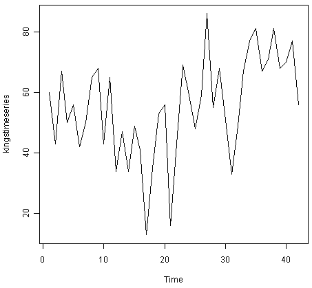
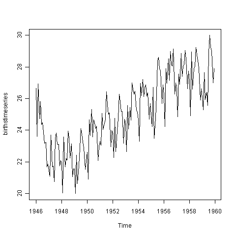
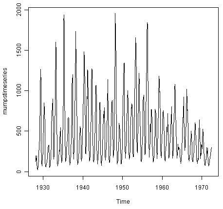
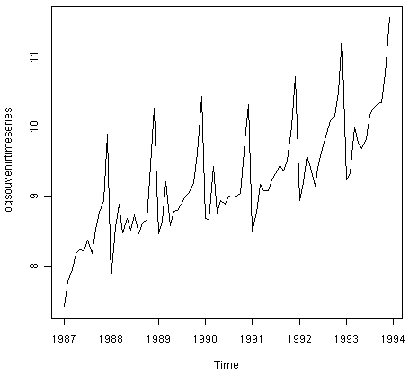
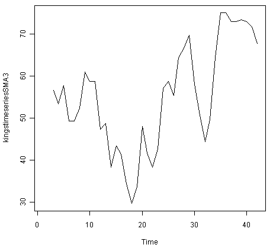
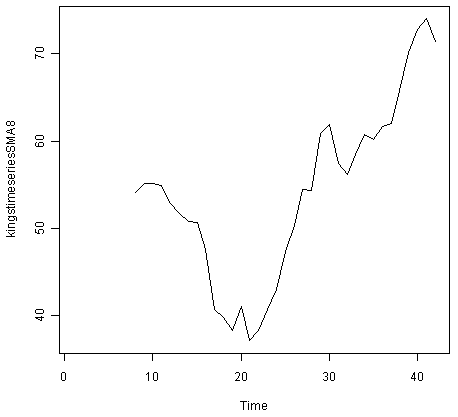
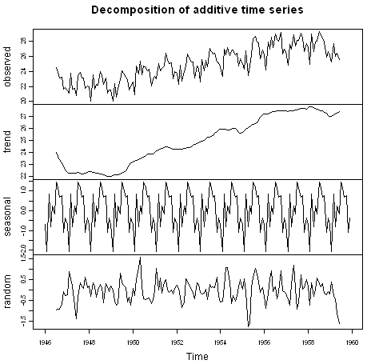
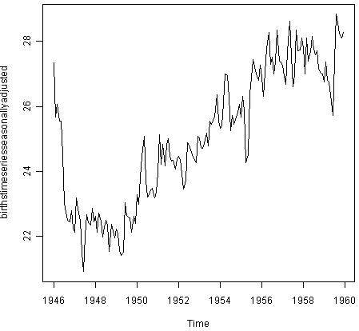
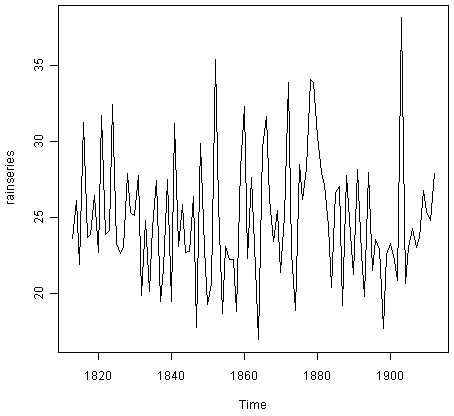
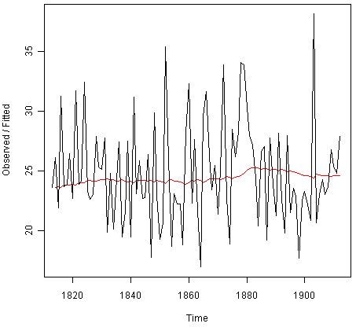
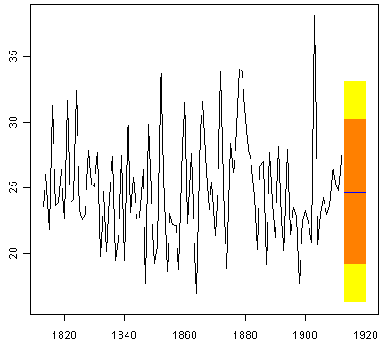
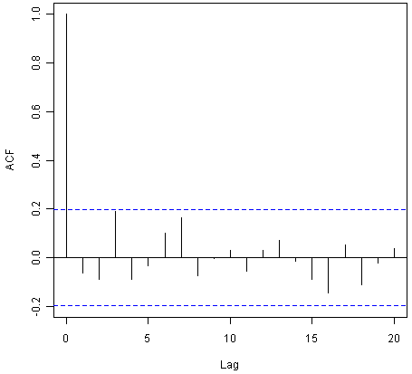

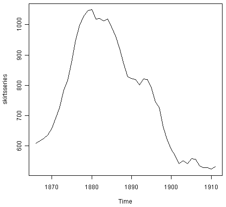
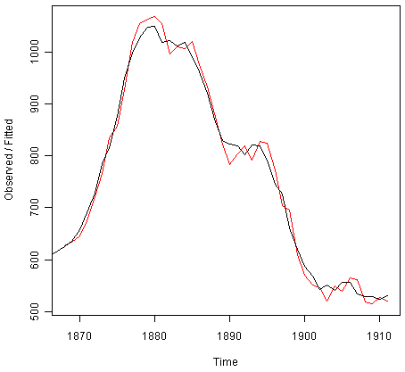
.. |image16| image:: ../_static/image16.png
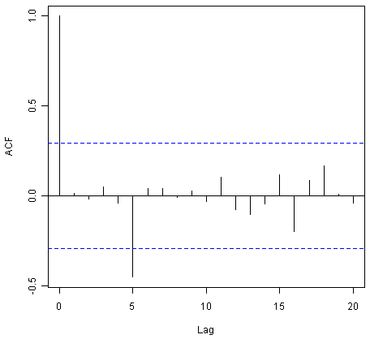
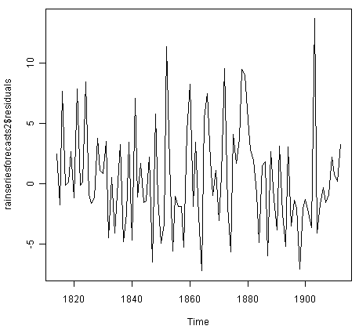
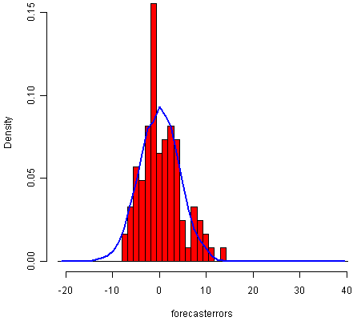
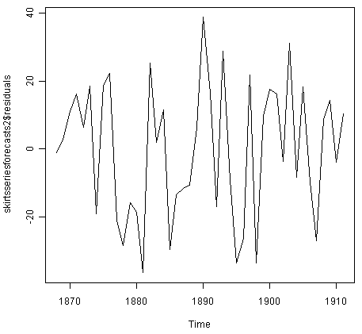
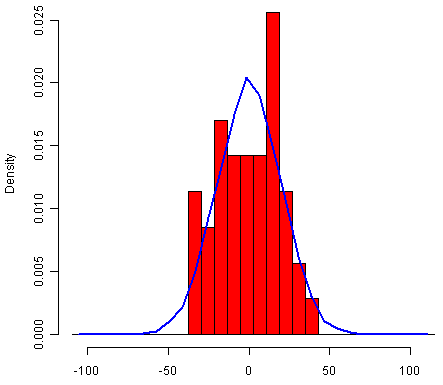
