Using R for Time Series Analysis 
================================

Time Series Analysis
--------------------

This booklet itells you how to use the R statistical software to carry out some simple analyses
that are common in analysing time series data. 

This booklet assumes that the reader has some basic knowledge of time series analysis, and
the principal focus of the booklet is not to explain time series analysis, but rather 
to explain how to carry out these analyses using R.

If you are new to time series analysis, and want to learn more about any of the concepts
presented here, I would highly recommend the Open University book 
"Time series" (product code M249/02), available from
from `the Open University Shop <http://www.ouw.co.uk/store/>`_.

In this booklet, I will be using time series data sets that have been kindly made
available by Rob Hyndman in his Time Series Data Library at
`http://robjhyndman.com/TSDL/ <http://robjhyndman.com/TSDL/>`_. 

There is a pdf version of this booklet available at
`https://github.com/avrilcoghlan/LittleBookofRTimeSeries/raw/master/_build/latex/TimeSeries.pdf <https://github.com/avrilcoghlan/LittleBookofRTimeSeries/raw/master/_build/latex/TimeSeries.pdf>`_.

If you like this booklet, you may also like to check out my booklet on using
R for biomedical statistics, 
`http://a-little-book-of-r-for-biomedical-statistics.readthedocs.org/
<http://a-little-book-of-r-for-biomedical-statistics.readthedocs.org/>`_,
and
my booklet on using R for multivariate analysis,
`http://little-book-of-r-for-multivariate-analysis.readthedocs.org/
<http://little-book-of-r-for-multivariate-analysis.readthedocs.org/>`_.

Reading Time Series Data
------------------------

The first thing that you will want to do to analyse your time series data will be to read
it into R, and to plot the time series. You can read data into R using the scan() function,
which assumes that your data for successive time points is in a simple text file with one column. 

For example, the file `http://robjhyndman.com/tsdldata/misc/kings.dat <http://robjhyndman.com/tsdldata/misc/kings.dat>`_ contains data on the age of death of successive kings of England, starting
with William the Conqueror (original source: Hipel and Mcleod, 1994). 

The data set looks like this:

.. highlight:: r

::

    Age of Death of Successive Kings of England
    #starting with William the Conqueror
    #Source: McNeill, "Interactive Data Analysis"
    60
    43
    67
    50
    56
    42
    50
    65
    68
    43
    65
    34
    ...

Only the first few lines of the file have been shown. The first three lines contain
some comment on the data, and we want to ignore this when we read the data into R.
We can use this by using the "skip" parameter of the scan() function, which specifies
how many lines at the top of the file to ignore. To read the file into R, ignoring the
first three lines, we type:

.. highlight:: r

::

    > kings <- scan("http://robjhyndman.com/tsdldata/misc/kings.dat",skip=3)
      Read 42 items
    > kings
      [1] 60 43 67 50 56 42 50 65 68 43 65 34 47 34 49 41 13 35 53 56 16 43 69 59 48
      [26] 59 86 55 68 51 33 49 67 77 81 67 71 81 68 70 77 56
      
In this case the age of death of 42 successive kings of England has been read into the
variable 'kings'.

Once you have read the time series data into R, the next step is to store the data in
a time series object in R, so that you can use R's many functions for analysing time series data.
To store the data in a time series object, we use the ts() function in R. For example,
to store the data in the variable 'kings' as a time series object in R, we type:

.. highlight:: r

::

    > kingstimeseries <- ts(kings)
    > kingstimeseries 
      Time Series:
      Start = 1 
      End = 42 
      Frequency = 1 
      [1] 60 43 67 50 56 42 50 65 68 43 65 34 47 34 49 41 13 35 53 56 16 43 69 59 48
      [26] 59 86 55 68 51 33 49 67 77 81 67 71 81 68 70 77 56

Sometimes the time series data set that you have may have been collected at regular intervals that
were less than one year, for example, monthly or quarterly. In this case, you can specify the number
of times that data was collected per year by using the 'frequency' parameter in the ts() function. 
For monthly time series data, you set frequency=12, while for quarterly time series data, you set 
frequency=4. 

You can also specify the first year that the data was collected, and the first interval
in that year by using the 'start' parameter in the ts() function. For example, if the first
data point corresponds to the second quarter of 1986, you would set start=c(1986,2). 

An example is a data set of the number of births per month in New York city, from
January 1946 to December 1959 (originally collected by Newton). This data is available
in the file `http://robjhyndman.com/tsdldata/data/nybirths.dat 
<http://robjhyndman.com/tsdldata/data/nybirths.dat>`_
We can read the data into R, and store it as a time series object, by typing:

.. highlight:: r

::

    > births <- scan("http://robjhyndman.com/tsdldata/data/nybirths.dat")
      Read 168 items
    > birthstimeseries <- ts(births, frequency=12, start=c(1946,1))
    > birthstimeseries
        Jan    Feb    Mar    Apr    May    Jun    Jul    Aug    Sep    Oct    Nov    Dec
      1946 26.663 23.598 26.931 24.740 25.806 24.364 24.477 23.901 23.175 23.227 21.672 21.870
      1947 21.439 21.089 23.709 21.669 21.752 20.761 23.479 23.824 23.105 23.110 21.759 22.073
      1948 21.937 20.035 23.590 21.672 22.222 22.123 23.950 23.504 22.238 23.142 21.059 21.573
      1949 21.548 20.000 22.424 20.615 21.761 22.874 24.104 23.748 23.262 22.907 21.519 22.025
      1950 22.604 20.894 24.677 23.673 25.320 23.583 24.671 24.454 24.122 24.252 22.084 22.991
      1951 23.287 23.049 25.076 24.037 24.430 24.667 26.451 25.618 25.014 25.110 22.964 23.981
      1952 23.798 22.270 24.775 22.646 23.988 24.737 26.276 25.816 25.210 25.199 23.162 24.707
      1953 24.364 22.644 25.565 24.062 25.431 24.635 27.009 26.606 26.268 26.462 25.246 25.180
      1954 24.657 23.304 26.982 26.199 27.210 26.122 26.706 26.878 26.152 26.379 24.712 25.688
      1955 24.990 24.239 26.721 23.475 24.767 26.219 28.361 28.599 27.914 27.784 25.693 26.881
      1956 26.217 24.218 27.914 26.975 28.527 27.139 28.982 28.169 28.056 29.136 26.291 26.987
      1957 26.589 24.848 27.543 26.896 28.878 27.390 28.065 28.141 29.048 28.484 26.634 27.735
      1958 27.132 24.924 28.963 26.589 27.931 28.009 29.229 28.759 28.405 27.945 25.912 26.619
      1959 26.076 25.286 27.660 25.951 26.398 25.565 28.865 30.000 29.261 29.012 26.992 27.897   

Similarly, the file `http://robjhyndman.com/tsdldata/data/fancy.dat 
<http://robjhyndman.com/tsdldata/data/fancy.dat>`_ contains monthly sales for a souvenir
shop at a beach resort town in Queensland, Australia, for January 1987-December 1993 (original
data from Wheelwright and Hyndman, 1998). We can read the data into R by typing:

.. highlight:: r

::

    > souvenir <- scan("http://robjhyndman.com/tsdldata/data/fancy.dat")
      Read 84 items
    > souvenirtimeseries <- ts(souvenir, frequency=12, start=c(1987,1))
    > souvenirtimeseries
      Jan       Feb       Mar       Apr       May       Jun       Jul       Aug       Sep       Oct       Nov       Dec
      1987   1664.81   2397.53   2840.71   3547.29   3752.96   3714.74   4349.61   3566.34   5021.82   6423.48   7600.60  19756.21
      1988   2499.81   5198.24   7225.14   4806.03   5900.88   4951.34   6179.12   4752.15   5496.43   5835.10  12600.08  28541.72
      1989   4717.02   5702.63   9957.58   5304.78   6492.43   6630.80   7349.62   8176.62   8573.17   9690.50  15151.84  34061.01
      1990   5921.10   5814.58  12421.25   6369.77   7609.12   7224.75   8121.22   7979.25   8093.06   8476.70  17914.66  30114.41
      1991   4826.64   6470.23   9638.77   8821.17   8722.37  10209.48  11276.55  12552.22  11637.39  13606.89  21822.11  45060.69
      1992   7615.03   9849.69  14558.40  11587.33   9332.56  13082.09  16732.78  19888.61  23933.38  25391.35  36024.80  80721.71
      1993  10243.24  11266.88  21826.84  17357.33  15997.79  18601.53  26155.15  28586.52  30505.41  30821.33  46634.38 104660.67

Plotting Time Series 
--------------------

Once you have read a time series into R, the next step is usually to make a plot of the time series
data, which you can do with the plot.ts() function in R.

For example, to plot the time series of the age of death of 42 successive kings of England, we type:

.. highlight:: r

::

    > plot.ts(kingstimeseries)

|image1|

We can see from the time plot that this time series could probably be described using an additive
model, since the random fluctuations in the data are roughly constant in size over time.

Likewise, to plot the time series of the number of births per month in New York city, we type:

.. highlight:: r

::

    > plot.ts(birthstimeseries)

|image2|

We can see from this time series that there seems to be seasonal variation in the number of
births per month: there is a peak every summer, and a trough every winter. Again, it seems 
that this time series could probably be described using an additive model, as the seasonal
fluctuations are roughly constant in size over time and do not seem to depend on the level
of the time series, and the random fluctuations also seem to be roughly constant in size over time.

Similarly, to plot the time series of the monthly sales for the souvenir
shop at a beach resort town in Queensland, Australia, we type:

.. highlight:: r

::

    > plot.ts(souvenirtimeseries)

|image4|

In this case, it appears that an additive model is not appropriate for describing this
time series, since the size of the seasonal fluctuations and random fluctuations seem
to increase with the level of the time series. Thus, we may need to transform the
time series in order to get a transformed time series that can be described using an
additive model. For example, we can transform the time series by calculating
the natural log of the original data:

.. highlight:: r

::

    > logsouvenirtimeseries <- log(souvenirtimeseries)
    > plot.ts(logsouvenirtimeseries)

|image5|

Here we can see that the size of the seasonal fluctuations and random fluctuations in
the log-transformed time series seem to be roughly constant over time, and do not depend
on the level of the time series. Thus, the log-transformed time series can probably be
described using an additive model. 

Decomposing Time Series
-----------------------

Decomposing a time series means separating it into its constituent components, which
are usually a trend component and an irregular component, and if it is a seasonal time
series, a seasonal component.

Decomposing Non-Seasonal Data
^^^^^^^^^^^^^^^^^^^^^^^^^^^^^

A non-seasonal time series consists of a trend component and an irregular component.
Decomposing the time series involves trying to separate the time series into these
components, that is, estimating the the trend component and the irregular component.

To estimate the trend component of a non-seasonal time series that can be described
using an additive model, it is common to use a smoothing method, such as calculating
the simple moving average of the time series. 

The SMA() function in the "TTR" R package can be used to smooth time series data using a 
simple moving average. To use this function, we first need to install the "TTR" R package 
(for instructions on how to install an R package, see `How to install an R package 
<./installr.html#how-to-install-an-r-package>`_).
Once you have installed the "TTR" R package, you can load the "TTR" R package by typing:

.. highlight:: r

::

    > library("TTR")

You can then use the "SMA()" function to smooth time series data. To use the SMA() function,
you need to specify the order (span) of the simple moving average, using the parameter "n". 
For example, to calculate a simple moving average of order 5, we set n=5 in the SMA() function.

For example, as discussed
above, the time series of the age of death of 42 successive kings of England appears is
non-seasonal, and can probably be described using an additive model, since the 
random fluctuations in the data are roughly constant in size over time:

|image1|

Thus, we can try to estimate the trend component of this time series by smoothing using a simple moving average.
To smooth the time series using a simple moving average of order 3, and plot the smoothed
time series data, we type:

.. highlight:: r

::

    > kingstimeseriesSMA3 <- SMA(kingstimeseries,n=3)
    > plot.ts(kingstimeseriesSMA3) 

|image6|

There still appears to be quite a lot of random fluctuations in the time series smoothed
using a simple moving average of order 3. Thus, to estimate the trend component more accurately, 
we might want to try smoothing the data with a simple moving average of a higher order. 
This takes a little bit of trial-and-error, to find the right amount of smoothing. 
For example, we can try using a simple moving average of order 8: 

.. highlight:: r

::

    > kingstimeseriesSMA8 <- SMA(kingstimeseries,n=8)
    > plot.ts(kingstimeseriesSMA8) 

|image7|

The data smoothed with a simple moving average of order 8 gives a clearer picture of the
trend component, and we can see that the age of death of the English kings seems to have
decreased from about 55 years old to about 38 years old during the reign of the first 20 kings, and
then increased after that to about 73 years old by the end of the reign of the 40th king in the time series. 

Decomposing Seasonal Data
^^^^^^^^^^^^^^^^^^^^^^^^^

A seasonal time series consists of a trend component, a seasonal component and an irregular
component. Decomposing the time series means separating the time series into these three
components: that is, estimating these three components.

To estimate the trend component and seasonal component of a seasonal time series that can be described
using an additive model, we can use the "decompose()" function in R. This function estimates the trend,
seasonal, and irregular components of a time series that can be described using an additive model.

The function "decompose()" returns a list object as its result, where the estimates of the seasonal
component, trend component and irregular component are stored in named elements of that list objects, called 
"seasonal", "trend", and "random" respectively.

For example, as discussed above, the time series of the number of births per month in New York city
is seasonal with a peak every summer and trough every winter, and can probably be described using
an additive model since the seasonal and random fluctuations seem to be roughly constant in size over time:

|image2|

To estimate the trend, seasonal and irregular components of this time series, we type:

.. highlight:: r

::

    > birthstimeseriescomponents <- decompose(birthstimeseries)
 
The estimated values of the seasonal, trend and irregular components are now stored in variables
birthstimeseriescomponents$seasonal, birthstimeseriescomponents$trend and birthstimeseriescomponents$random.
For example, we can print out the estimated values of the seasonal component by typing:

::

    > birthstimeseriescomponents$seasonal # get the estimated values of the seasonal component
           Jan        Feb        Mar        Apr        May        Jun        Jul        Aug        Sep        Oct        Nov        Dec
     1946 -0.6771947 -2.0829607  0.8625232 -0.8016787  0.2516514 -0.1532556  1.4560457  1.1645938  0.6916162  0.7752444 -1.1097652 -0.3768197
     1947 -0.6771947 -2.0829607  0.8625232 -0.8016787  0.2516514 -0.1532556  1.4560457  1.1645938  0.6916162  0.7752444 -1.1097652 -0.3768197
     1948 -0.6771947 -2.0829607  0.8625232 -0.8016787  0.2516514 -0.1532556  1.4560457  1.1645938  0.6916162  0.7752444 -1.1097652 -0.3768197
     1949 -0.6771947 -2.0829607  0.8625232 -0.8016787  0.2516514 -0.1532556  1.4560457  1.1645938  0.6916162  0.7752444 -1.1097652 -0.3768197
     1950 -0.6771947 -2.0829607  0.8625232 -0.8016787  0.2516514 -0.1532556  1.4560457  1.1645938  0.6916162  0.7752444 -1.1097652 -0.3768197
     1951 -0.6771947 -2.0829607  0.8625232 -0.8016787  0.2516514 -0.1532556  1.4560457  1.1645938  0.6916162  0.7752444 -1.1097652 -0.3768197
     1952 -0.6771947 -2.0829607  0.8625232 -0.8016787  0.2516514 -0.1532556  1.4560457  1.1645938  0.6916162  0.7752444 -1.1097652 -0.3768197
     1953 -0.6771947 -2.0829607  0.8625232 -0.8016787  0.2516514 -0.1532556  1.4560457  1.1645938  0.6916162  0.7752444 -1.1097652 -0.3768197
     1954 -0.6771947 -2.0829607  0.8625232 -0.8016787  0.2516514 -0.1532556  1.4560457  1.1645938  0.6916162  0.7752444 -1.1097652 -0.3768197
     1955 -0.6771947 -2.0829607  0.8625232 -0.8016787  0.2516514 -0.1532556  1.4560457  1.1645938  0.6916162  0.7752444 -1.1097652 -0.3768197
     1956 -0.6771947 -2.0829607  0.8625232 -0.8016787  0.2516514 -0.1532556  1.4560457  1.1645938  0.6916162  0.7752444 -1.1097652 -0.3768197
     1957 -0.6771947 -2.0829607  0.8625232 -0.8016787  0.2516514 -0.1532556  1.4560457  1.1645938  0.6916162  0.7752444 -1.1097652 -0.3768197
     1958 -0.6771947 -2.0829607  0.8625232 -0.8016787  0.2516514 -0.1532556  1.4560457  1.1645938  0.6916162  0.7752444 -1.1097652 -0.3768197
     1959 -0.6771947 -2.0829607  0.8625232 -0.8016787  0.2516514 -0.1532556  1.4560457  1.1645938  0.6916162  0.7752444 -1.1097652 -0.3768197
    
The estimated seasonal factors are given for the months January-December, and are the same for each year. The largest
seasonal factor is for July (about 1.46), and the lowest is for February (about -2.08), indicating that there seems
to be a peak in births in July and a trough in births in February each year. 

We can plot the estimated trend, seasonal, and irregular components of the time series by using the "plot()" function, for example:

::

    > plot(birthstimeseriescomponents) 

|image8|

The plot above shows the original time series (top), the estimated trend component (second from top), the estimated seasonal
component (third from top), and the estimated irregular component (bottom). We see that the estimated trend component shows
a small decrease from about 24 in 1947 to about 22 in 1948, followed by a steady increase from then on to about 27 in 1959.

Seasonally Adjusting
^^^^^^^^^^^^^^^^^^^^

If you have a seasonal time series that can be described using an additive model, you can seasonally adjust the time series
by estimating the seasonal component, and subtracting the estimated seasonal component from the original time series. We can
do this using the estimate of the seasonal component calculated by the "decompose()" function.

For example, to seasonally adjust the time series of the number of births per month in New York city, we can estimate the
seasonal component using "decompose()", and then subtract the seasonal component from the original time series:

::

    > birthstimeseriescomponents <- decompose(birthstimeseries)
    > birthstimeseriesseasonallyadjusted <- birthstimeseries - birthstimeseriescomponents$seasonal 

We can then plot the seasonally adjusted time series using the "plot()" function, by typing:

::

    > plot(birthstimeseriesseasonallyadjusted)

|image9|

You can see that the seasonal variation has been removed from the seasonally adjusted time series.
The seasonally adjusted time series now just contains the trend component and an irregular component.

Forecasts using Exponential Smoothing
-------------------------------------

Exponential smoothing can be used to make short-term forecasts for time series data. 

Simple Exponential Smoothing
^^^^^^^^^^^^^^^^^^^^^^^^^^^^

If you have a time series that can be described using an additive model with constant
level and no seasonality, you can use simple exponential smoothing to make short-term
forecasts. 

The simple exponential smoothing method provides a way of estimating the level at the current
time point. Smoothing is controlled by the parameter alpha; for the estimate of the level
at the current time point. The value of	alpha; lies between 0 and 1. Values of alpha
that are close to 0 mean that little weight is placed on the most recent observations
when making forecasts of future values.

For example, the file `http://robjhyndman.com/tsdldata/hurst/precip1.dat 
<http://robjhyndman.com/tsdldata/hurst/precip1.dat>`_ contains total annual rainfall in
inches for London, from 1813-1912 (original data from Hipel and McLeod, 1994).
We can read the data into R and plot it by typing:

::

    > rain <- scan("http://robjhyndman.com/tsdldata/hurst/precip1.dat",skip=1)
      Read 100 items
    > rainseries <- ts(rain,start=c(1813))
    > plot.ts(rainseries)

|image10|

You can see from the plot that there is roughly constant level (the mean stays
constant at about 25 inches). The random fluctuations in the time series seem to be
roughly constant in size over time, so it is probably appropriate to describe the
data using an additive model. Thus, we can make forecasts using simple exponential
smoothing.

To make forecasts using simple exponential smoothing in R, we can fit a simple exponential
smoothing predictive model using the 
"HoltWinters()" function in R. To use HoltWinters() for simple exponential smoothing,
we need to set the parameters beta=FALSE and gamma=FALSE in the HoltWinters() function
(the beta and gamma parameters are used for Holt's exponential smoothing, or
Holt-Winters exponential smoothing, as described below). 

The HoltWinters() function returns a list variable, that contains several named
elements. 

For example, to use simple exponential smoothing to make forecasts for the time
series of annual rainfall in London, we type:

::

    > rainseriesforecasts <- HoltWinters(rainseries, beta=FALSE, gamma=FALSE)
    > rainseriesforecasts
      Smoothing parameters:
      alpha:  0.02412151 
      beta :  FALSE 
      gamma:  FALSE 
      Coefficients:
        [,1]
      a 24.67819
      
The output of HoltWinters() tells us that the estimated value of the alpha parameter
is about 0.024. This is very close to zero, telling us that the forecasts are based on
both recent and less recent observations (although somewhat more weight is placed on recent observations).  

By default, HoltWinters() just makes forecasts for the same time period covered by
our original time series. In this case, our original time series included rainfall
for London from 1813-1912, so the forecasts are also for 1813-1912. 

In the example above, we have stored the output of the HoltWinters() function in the list variable 
"rainseriesforecasts". The forecasts made by HoltWinters() are stored in a named element
of this list variable called "fitted", so we can get their values by typing:

::

    > rainseriesforecasts$fitted
      Time Series:
      Start = 1814 
      End = 1912 
      Frequency = 1 
         xhat    level
      1814 23.56000 23.56000
      1815 23.62054 23.62054
      1816 23.57808 23.57808
      1817 23.76290 23.76290
      1818 23.76017 23.76017
      1819 23.76306 23.76306
      1820 23.82691 23.82691
      ...
      1905 24.62852 24.62852
      1906 24.58852 24.58852
      1907 24.58059 24.58059
      1908 24.54271 24.54271
      1909 24.52166 24.52166
      1910 24.57541 24.57541
      1911 24.59433 24.59433
      1912 24.59905 24.59905
     
We can plot the original time series against the forecasts by typing:

::

    > plot(rainseriesforecasts)

|image11|

The plot shows the original time series in black, and the forecasts as a red line.
The time series of forecasts is much smoother than the time series of the original data here.

As a measure of the accuracy of the forecasts, we can calculate the sum of squared
errors for the in-sample forecast errors, that is, the forecast errors for the time
period covered by our original time series. The sum-of-squared-errors is stored in a 
named element of the list variable "rainseriesforecasts" called "SSE", so we can get 
its value by typing:

::

    > rainseriesforecasts$SSE
      [1] 1828.855

That is, here the sum-of-squared-errors is 1828.855.

It is common in simple exponential smoothing to use the first value in the time series
as the initial value for the level. For example, in the time series for rainfall in London,
the first value is 23.56 (inches) for rainfall in 1813. You can specify the initial value
for the level in the HoltWinters() function by using the "l.start" parameter. For example,
to make forecasts with the initial value of the level set to 23.56, we type:

::

    > HoltWinters(rainseries, beta=FALSE, gamma=FALSE, l.start=23.56)

As explained above, by default HoltWinters() just makes forecasts for the time period
covered by the original data, which is 1813-1912 for the rainfall time series. We can
make forecasts for further time points by using the "forecast.HoltWinters()" function in 
the R "forecast" package. To use the forecast.HoltWinters() function, we first need to install 
the "forecast" R package (for instructions on how to install an R package, see `How to install an R package 
<./installr.html#how-to-install-an-r-package>`_).

Once you have installed the "forecast" R package, you can load the "forecast" R package by typing:

.. highlight:: r

::

    > library("forecast")

When using the forecast.HoltWinters() function, as its first argument (input), you pass it
the predictive model that you have already fitted using the HoltWinters() function. For example,
in the case of the rainfall time series, we stored the predictive model made using HoltWinters()
in the variable "rainseriesforecasts". You specify how many further time points you want to make 
forecasts for by using the "h" parameter in forecast.HoltWinters(). For example, to make a forecast
of rainfall for the years 1814-1820 (8 more years) using forecast.HoltWinters(), we type:

.. highlight:: r

::

    > rainseriesforecasts2 <- forecast.HoltWinters(rainseriesforecasts, h=8) 
    > rainseriesforecasts2
     Point     Forecast    Lo 80    Hi 80    Lo 95    Hi 95
     1913       24.67819 19.17493 30.18145 16.26169 33.09470
     1914       24.67819 19.17333 30.18305 16.25924 33.09715
     1915       24.67819 19.17173 30.18465 16.25679 33.09960
     1916       24.67819 19.17013 30.18625 16.25434 33.10204
     1917       24.67819 19.16853 30.18785 16.25190 33.10449
     1918       24.67819 19.16694 30.18945 16.24945 33.10694
     1919       24.67819 19.16534 30.19105 16.24701 33.10938
     1920       24.67819 19.16374 30.19265 16.24456 33.11182
      
The forecast.HoltWinters() function gives you the forecast for a year, a 80% prediction
interval for the forecast, and a 95% prediction interval for the forecast. For example,
the forecasted rainfall for 1920 is about 24.68 inches, with a 95% prediction interval of
(16.24, 33.11). 

To plot the predictions made by forecast.HoltWinters(), we can use the "plot.forecast()" function:

.. highlight:: r

::

    > plot.forecast(rainseriesforecasts2) 

|image12|

Here the forecasts for 1913-1920 are plotted as a blue line, the 80% prediction interval
as an orange shaded area, and the 95% prediction interval as a yellow shaded area.

The 'forecast errors' are calculated as the observed values minus predicted values, for
each time point. We can only calculate the forecast errors for the time period covered
by our original time series, which is 1813-1912 for the rainfall data. As mentioned above,
one measure of the accuracy of the predictive model is the sum-of-squared-errors (SSE) for
the in-sample forecast errors. 

The in-sample forecast errors are stored in the named element "residuals" of the list
variable returned by forecast.HoltWinters(). If the predictive model cannot be improved upon,
there should be no correlations between forecast errors for successive predictions.  
In other words, if there are correlations between forecast errors for successive predictions,
it is likely that the simple exponential smoothing forecasts could be improved upon by another
forecasting technique. 

To figure out whether this is the case, we can obtain a correlogram of the in-sample
forecast errors for lags 1-20. We can calculate a correlogram of the forecast errors using the 
"acf()" function in R. To specify the maximum lag that we want to look at, we use the "lag.max"
parameter in acf(). 

For example, to calculate a correlogram of the in-sample forecast errors for the
London rainfall data for lags 1-20, we type:

.. highlight:: r

::

    > acf(rainseriesforecasts2$residuals, lag.max=20)

|image13|

You can see from the sample correlogram that the autocorrelation at lag 3 is just touching
the significance bounds. To test whether there is significant evidence for non-zero correlations
at lags 1-20, we can carry out a Ljung-Box test. This can be done in R using the "Box.test()", 
function. The maximum lag that we want to look at is specified using the "lag" parameter in the
Box.test() function. For example, to test whether there are non-zero autocorrelations at
lags 1-20, for the in-sample forecast errors for London rainfall data, we type:

.. highlight:: r

::

    > Box.test(rainseriesforecasts2$residuals, lag=20, type="Ljung-Box")
        Box-Ljung test
      data:  rainseriesforecasts2$residuals 
      X-squared = 17.4008, df = 20, p-value = 0.6268

Here the Ljung-Box test statistic is 17.4, and the p-value is 0.6, so there is little evidence
of non-zero autocorrelations in the in-sample forecast errors at lags 1-20. 

To be sure that the predictive model cannot be improved upon, it is also a good idea to check
whether the forecast errors are normally distributed with mean zero and constant variance. To
check whether the forecast errors have constant variance, we can make a time plot of the in-sample
forecast errors:

.. highlight:: r

::

    > plot.ts(rainseriesforecasts2$residuals) 

|image18|

The plot shows that the in-sample forecast errors seem to have roughly constant variance over time,
although the size of the fluctuations in the start of the time series (1820-1830) may be slightly
less than that at later dates (eg. 1840-1850). 

To check whether the forecast errors are normally distributed with mean zero, we can plot a histogram
of the forecast errors, with an overlaid normal curve that has mean zero and the same standard deviation as
the distribution of forecast errors. To do this, we can define an R function "plotForecastErrors()", below:

.. highlight:: r

::

    > plotForecastErrors <- function(forecasterrors)
      {
         # make a red histogram of the forecast errors: 
         mybinsize <- IQR(forecasterrors)/4
         mymin  <- min(forecasterrors)*3      
         mymax  <- max(forecasterrors)*3     
         mybins <- seq(mymin, mymax, mybinsize)
         hist(forecasterrors, col="red", freq=FALSE, breaks=mybins) 
         # freq=FALSE ensures the area under the histogram = 1
         mysd   <- sd(forecasterrors)
         # generate normally distributed data with mean 0 and standard deviation mysd
         mynorm <- rnorm(10000, mean=0, sd=mysd)
         myhist <- hist(mynorm, plot=FALSE, breaks=mybins) 
         # plot the normal curve as a blue line on top of the histogram of forecast errors:
         points(myhist$mids, myhist$density, type="l", col="blue", lwd=2) 
      } 

You will have to copy the function above into R in order to use it. 
You can then use plotForecastErrors() to plot a histogram (with overlaid normal curve) 
of the forecast errors for the rainfall predictions:

.. highlight:: r

::

    > plotForecastErrors(rainseriesforecasts2$residuals)

|image19|

The plot shows that the distribution of forecast errors is roughly centred on zero, and
is more or less normally distributed, although it seems to be slightly skewed to the right
compared to a normal curve. However, the right skew is relatively small, and so it is 
plausible that the forecast errors are normally distributed with mean zero.

The Ljung-Box test showed that there is little evidence of non-zero autocorrelations in the in-sample
forecast errors, and the distribution of forecast errors seems to be normally distributed with mean zero.
This suggests that the simple exponential smoothing method provides an adequate predictive model for London
rainfall, which probably cannot be improved upon. Furthermore, the assumptions that the 80% and 95% predictions intervals were based upon 
(that there are no autocorrelations in the forecast errors, and the forecast errors are normally distributed
with mean zero and constant variance) are probably valid. 

Holt's Exponential Smoothing
^^^^^^^^^^^^^^^^^^^^^^^^^^^^

If you have a time series that can be described using an additive model with increasing or
decreasing trend and no seasonality, you can use Holt's exponential smoothing to make short-term
forecasts. 

Holt's exponential smoothing estimates the level and slope at the current time point. Smoothing
is controlled by two parameters, alpha, for the estimate of the level at the current time point,
and beta for the estimate of the slope b of the trend component at the current time point.
As with simple exponential smoothing, the paramters alpha and beta have values between 0 and 1,
and values that are close to 0 mean that little weight is placed on the most recent observations
when making forecasts of future values.

An example of a time series that can probably be described using an additive model with a
trend and no seasonality is the time series of the annual diameter of women's skirts
at the hem, from 1866 to 1911. The data is available in the file `http://robjhyndman.com/tsdldata/roberts/skirts.dat <http://robjhyndman.com/tsdldata/roberts/skirts.dat>`_ (original data from
Hipel and McLeod, 1994). 

We can read in and plot the data in R by typing:

::

    > skirts <- scan("http://robjhyndman.com/tsdldata/roberts/skirts.dat",skip=5)
      Read 46 items
    > skirtsseries <- ts(skirts,start=c(1866))
    > plot.ts(skirtsseries)

|image14|

We can see from the plot that there was an increase in hem diameter from about 600 in
1866 to about 1050 in 1880, and that afterwards the hem diameter decreased to about 520 in
1911. 

To make forecasts, we can fit a predictive model using the HoltWinters() function in R. 
To use HoltWinters() for Holt's exponential smoothing, we need to set the parameter gamma=FALSE 
(the gamma parameter is used for Holt-Winters exponential smoothing, as described below).

For example, to use Holt's exponential smoothing to fit a predictive model for skirt hem
diameter, we type:

::

    > skirtsseriesforecasts <- HoltWinters(skirtsseries, gamma=FALSE)
    > skirtsseriesforecasts 
      Smoothing parameters:
      alpha:  0.8383481 
      beta :  1 
      gamma:  FALSE 
      Coefficients:
        [,1]
      a 529.308585
      b   5.690464
    > skirtsseriesforecasts$SSE 
      [1] 16954.18

The estimated value of alpha is 0.84, and of beta is 1.00. These are both high, telling us that
both the estimate of the current value of the level, and of the slope b of the trend component,
are based mostly upon very recent observations in the time series. This makes good intuitive sense,
since the level and the slope of the time series both change quite a lot over time. The 
value of the sum-of-squared-errors for the in-sample forecast errors is 16954. 

We can plot the original time series as a black line, with the forecasted values as a red line
on top of that, by typing:

::

    > plot(skirtsseriesforecasts) 

|image15|

We can see from the picture that the in-sample forecasts agree pretty well with the observed values,
although they tend to lag behind the observed values a little bit. 

If you wish, you can specify the initial values of the level and the slope b of the trend component by
using the "l.start" and "b.start" arguments for the HoltWinters() function. It is common to set the
initial value of the level to the first value in the time series (608 for the skirts data), and the 
initial value of the slope to the second value minus the first value (9 for the skirts data). For example,
to fit a predictive model to the skirt hem data using Holt's exponential smoothing, with initial values
of 608 for the level and 9 for the slope b of the trend component, we type:

::

    > HoltWinters(skirtsseries, gamma=FALSE, l.start=608, b.start=9)

As for simple exponential smoothing, we can make forecasts for future times not covered
by the original time series by using the forecast.HoltWinters() function in the "forecast" package.
For example, our time series data for skirt hems was for 1866 to 1911, so we can make predictions
for 1912 to 1930 (19 more data points), and plot them, by typing: 

::

    > skirtsseriesforecasts2 <- forecast.HoltWinters(skirtsseriesforecasts, h=19)
    > plot.forecast(skirtsseriesforecasts2) 

|image16|

The forecasts are shown as a blue line, with the 80% prediction intervals as an orange
shaded area, and the 95% prediction intervals as a yellow shaded area.

As for simple exponential smoothing, we can check whether the predictive model could
be improved upon by checking whether the in-sample forecast errors show non-zero autocorrelations
at lags 1-20. For example, for the skirt hem data, we can make a correlogram, and carry out
the Ljung-Box test, by typing:

::

    > acf(skirtsseriesforecasts2$residuals, lag.max=20)
    > Box.test(skirtsseriesforecasts2$residuals, lag=20, type="Ljung-Box")
        Box-Ljung test
      data:  skirtsseriesforecasts2$residuals 
      X-squared = 19.7312, df = 20, p-value = 0.4749
    
|image17|

Here the correlogram shows that the sample autocorrelation for the in-sample forecast errors
at lag 5 exceeds the significance bounds. However, we would expect one in 20 of the autocorrelations
for the first twenty lags to exceed the 95% significance bounds by chance alone. Indeed, when we carry
out the Ljung-Box test, the p-value is 0.47, indicating that there is little evidence of non-zero
autocorrelations in the in-sample forecast errors at lags 1-20. 

As for simple exponential smoothing, we should also check that the forecast errors have constant
variance over time, and are normally distributed with mean zero. We can do this by making a time
plot of forecast errors, and a histogram of the distribution of forecast errors with an overlaid
normal curve:

.. highlight:: r

::

    > plot.ts(skirtsseriesforecasts2$residuals)            # make a time plot
    > plotForecastErrors(skirtsseriesforecasts2$residuals) # make a histogram 

|image20|

|image21|

The time plot of forecast errors shows that the forecast errors have roughly constant variance over time.
The histogram of forecast errors show that it is plausible that the forecast errors are normally distributed
with mean zero and constant variance. 

Thus, the Ljung-Box test shows that there is little evidence of autocorrelations in the forecast errors,
while the time plot and histogram of forecast errors show that it is plausible that the forecast errors
are normally distributed with mean zero and constant variance. Therefore, we can conclude that Holt's
exponential smoothing provides an adequate predictive model for skirt hem diameters, which probably cannot
be improved upon. In addition, it means that the assumptions that the 80% and 95% predictions intervals were based upon 
are probably valid.

Holt-Winters Exponential Smoothing
^^^^^^^^^^^^^^^^^^^^^^^^^^^^^^^^^^
If you have a time series that can be described using an additive model with increasing or decreasing trend and
seasonality, you can use Holt-Winters exponential smoothing to make short-term forecasts.

Holt-Winters exponential smoothing estimates the level, slope and seasonal component at the current time point.
Smoothing is controlled by three parameters: alpha, beta, and gamma, for the estimates of the level, slope b
of the trend component, and the seasonal component, respectively, at the current time point. The parameters
alpha, beta and gamma all have values between 0 and 1, and values that are close to 0 mean that 
relatively little weight is placed on the most recent observations when making forecasts of future values.

An example of a time series that can probably be described using an additive model with a trend and seasonality
is the time series of the log of monthly sales for the souvenir shop at a beach resort town in Queensland, Australia
(discussed above):

|image5|

To make forecasts, we can fit a predictive model using the HoltWinters() function. For example, to fit a predictive
model for the log of the monthly sales in the souvenir shop, we type:

.. highlight:: r

::

    > logsouvenirtimeseries <- log(souvenirtimeseries)
    > souvenirtimeseriesforecasts <- HoltWinters(logsouvenirtimeseries)
    > souvenirtimeseriesforecasts
      Holt-Winters exponential smoothing with trend and additive seasonal component.
      Smoothing parameters:
      alpha:  0.413418 
      beta :  0 
      gamma:  0.9561275 
      Coefficients:
           [,1]
       a   10.37661961
       b    0.02996319
       s1  -0.80952063
       s2  -0.60576477
       s3   0.01103238
       s4  -0.24160551
       s5  -0.35933517
       s6  -0.18076683
       s7   0.07788605
       s8   0.10147055
       s9   0.09649353
       s10  0.05197826
       s11  0.41793637
       s12  1.18088423
    > souvenirtimeseriesforecasts$SSE
      2.011491

The estimated values of alpha, beta and gamma are 0.41, 0.00, and 0.96, respectively. The
value of alpha (0.41) is relatively low, indicating that the estimate of the level at the current time
point is based upon both recent observations and some observations in the more distant past. The value of beta is 0.00, indicating that
the estimate of the slope b of the trend component is not updated over the time series, and instead
is set equal to its initial value. This makes good intuitive sense, as the level changes quite a bit
over the time series, but the slope b of the trend component remains roughly the same. 
In contrast, the  value of gamma (0.96) is high, indicating that the estimate of the seasonal component at the current
time point is just based upon very recent observations. 

As for simple exponential smoothing and Holt's exponential smoothing, we can plot the original time series
as a black line, with the forecasted values as a red line on top of that:

.. highlight:: r

::

    > plot(souvenirtimeseriesforecasts) 

|image22|

We see from the plot that the Holt-Winters exponential method is very successful in predicting
the seasonal peaks, which occur roughly in November every year. 

To make forecasts for future times not included in the original time series, we use the 
"forecast.HoltWinters()" function in the "forecast" package. For example, the original
data for the souvenir sales is from January 1987 to December 1993. If we wanted to make
forecasts for January 1994 to December 1998 (48 more months), and plot the forecasts, we would type:

.. highlight:: r

::

    > souvenirtimeseriesforecasts2 <- forecast.HoltWinters(souvenirtimeseriesforecasts, h=48)
    > plot.forecast(souvenirtimeseriesforecasts2)

|image23|

The forecasts are shown as a blue line, and the orange and yellow shaded areas show 80% and
95% prediction intervals, respectively.

We can investigate whether the predictive model can be improved upon by checking whether the
in-sample forecast errors show non-zero autocorrelations at lags 1-20, by making a correlogram
and carrying out the Ljung-Box test:

.. highlight:: r

::

    > acf(souvenirtimeseriesforecasts2$residuals, lag.max=20)
    > Box.test(souvenirtimeseriesforecasts2$residuals, lag=20, type="Ljung-Box")
      Box-Ljung test
      data:  souvenirtimeseriesforecasts2$residuals 
      X-squared = 17.5304, df = 20, p-value = 0.6183

|image24|

The correlogram shows that the autocorrelations for the in-sample forecast errors do not exceed
the significance bounds for lags 1-20. Furthermore, the p-value for Ljung-Box test is 0.6, indicating
that there is little evidence of non-zero autocorrelations at lags 1-20.

We can check whether the forecast errors have constant variance over time, and are normally distributed
with mean zero, by making a time plot of the forecast errors and a histogram (with overlaid normal curve):

.. highlight:: r

::

    > plot.ts(souvenirtimeseriesforecasts2$residuals)            # make a time plot
    > plotForecastErrors(souvenirtimeseriesforecasts2$residuals) # make a histogram 

|image25|
|image26|

From the time plot, it appears plausible that the forecast errors have constant variance over time.
From the histogram of forecast errors, it seems plausible that the forecast errors are normally
distributed with mean zero.

Thus,there is little evidence of autocorrelation at lags 1-20 for the forecast errors, and
the forecast errors appear to be normally distributed with mean zero and constant variance over time.
This suggests that Holt-Winters exponential smoothing provides an adequate predictive model of the
log of sales at the souvenir shop, which probably cannot be improved upon. Furthermore, the assumptions
upon which the prediction intervals were based are probably valid.

ARIMA Models
------------

Exponential smoothing methods are useful for making forecasts, and make no assumptions about
the correlations between successive values of the time series. However, if you want to make
prediction intervals for forecasts made using exponential smoothing methods, the prediction
intervals require that the forecast errors are uncorrelated and are normally distributed with
mean zero and constant variance.

While exponential smoothing methods do not make any assumptions about correlations between successive
values of the time series, in some cases you can make a better predictive model by taking correlations
in the data into account. Autoregressive Integrated Moving Average (ARIMA) models include an explicit
statistical model for the irregular component of a time series, that allows for non-zero autocorrelations
in the irregular component.

Differencing a Time Series
^^^^^^^^^^^^^^^^^^^^^^^^^^

ARIMA models are defined for stationary time series. Therefore, if you start off with a non-stationary
time series, you will first need to 'difference' the time series until you obtain a stationary time series.
If you have to difference the time series d times to obtain a stationary series, then you have an
ARIMA(p,d,q) model, where d is the order of differencing used. 

You can difference a time series using the "diff()" function in R. For example, the time series of
the annual diameter of women's skirts at the hem, from 1866 to 1911 is not stationary in mean, as the
level changes a lot over time:

|image14|

We can difference the time series (which we stored in "skirtsseries", see above) once, and plot the
differenced series, by typing:

::

    > skirtsseriesdiff1 <- diff(skirtsseries, differences=1)
    > plot.ts(skirtsseriesdiff1) 

|image27| 

The resulting time series of first differences (above) does not appear to be stationary in mean.
Therefore, we can difference the time series twice, to see if that gives us a stationary time series:

::

    > skirtsseriesdiff2 <- diff(skirtsseries, differences=2)
    > plot.ts(skirtsseriesdiff2) 

|image28| 

.. sidebar:: Formal tests for stationarity      

   Formal tests for stationarity called "unit root tests" are available in the
   fUnitRoots package, available on CRAN, but will not be discussed here.

The time series of second differences (above) does appear to be stationary in mean and variance,
as the level of the series stays roughly constant over time, and the variance of the series appears
roughly constant over time. Thus, it appears that we need to difference the time series of the diameter of skirts
twice in order to achieve a stationary series. 

If you need to difference your original time series data d times in order to obtain a stationary
time series, this means that you can use an ARIMA(p,d,q) model for your time series, where d is 
the order of differencing used. For example, for the time series of the diameter of women's skirts,
we had to difference the time series twice, and so the order of differencing (d) is 2. This means
that you can use an ARIMA(p,2,q) model for your time series. The next step is to figure out the
values of p and q for the ARIMA model.

Another example is the time series of the age of death of the successive kings of England (see above):

|image1|

From the time plot (above), we can see that the time series is not stationary in mean. To
calculate the time series of first differences, and plot it, we type:

::

    > kingtimeseriesdiff1 <- diff(kingstimeseries, differences=1)
    > plot.ts(kingtimeseriesdiff1) 

|image29|

The time series of first differences appears to be stationary in mean and variance, and so
an ARIMA(p,1,q) model is probably appropriate for the time series of the age of death of the kings of England.
By taking the time series of first differences, we have removed the trend component of the time
series of the ages at death of the kings, and are left with an irregular component. 
We can now examine whether there are correlations between successive terms of this irregular 
component; if so, this could help us to make a predictive model for the ages at death of the kings.

Selecting a Candidate ARIMA Model
^^^^^^^^^^^^^^^^^^^^^^^^^^^^^^^^^

If your time series is stationary, or if you have transformed it to a stationary time series
by differencing d times, the next step is to select the appropriate ARIMA model, which means
finding the values of most appropriate values of p and q for an ARIMA(p,d,q) model. To do this,
you usually need to examine the correlogram and partial correlogram of the stationary time series.

To plot a correlogram and partial correlogram, we can use the "acf()" and "pacf()" functions in R,
respectively. To get the actual values of the autocorrelations and partial autocorrelations, we
set "plot=FALSE" in the "acf()" and "pacf()" functions.

Example of the Ages at Death of the Kings of England
""""""""""""""""""""""""""""""""""""""""""""""""""""

For example, to plot the correlogram for lags 1-20 of the once differenced time series of the 
ages at death of the kings of England, and to get the values of the autocorrelations, we type:

::

    > acf(kingtimeseriesdiff1, lag.max=20)             # plot a correlogram
    > acf(kingtimeseriesdiff1, lag.max=20, plot=FALSE) # get the autocorrelation values
      Autocorrelations of series 'kingtimeseriesdiff1', by lag
         0      1      2      3      4      5      6      7      8      9     10 
      1.000 -0.360 -0.162 -0.050  0.227 -0.042 -0.181  0.095  0.064 -0.116 -0.071 
         11     12     13     14     15     16     17     18     19     20 
      0.206 -0.017 -0.212  0.130  0.114 -0.009 -0.192  0.072  0.113 -0.093 

|image30|

We see from the correlogram that the autocorrelation at lag 1 (-0.360) exceeds the significance bounds,
but all other autocorrelations between lags 1-20 do not exceed the significance bounds. 

To plot the partial correlogram for lags 1-20 for the once differenced time series of the ages at
death of the English kings, and get the values of the partial autocorrelations,
we use the "pacf()" function, by typing:

::

    > pacf(kingtimeseriesdiff1, lag.max=20)             # plot a partial correlogram
    > pacf(kingtimeseriesdiff1, lag.max=20, plot=FALSE) # get the partial autocorrelation values
      Partial autocorrelations of series 'kingtimeseriesdiff1', by lag
        1      2      3      4      5      6      7      8      9     10     11 
      -0.360 -0.335 -0.321  0.005  0.025 -0.144 -0.022 -0.007 -0.143 -0.167  0.065 
        12     13     14     15     16     17     18     19     20 
       0.034 -0.161  0.036  0.066  0.081 -0.005 -0.027 -0.006 -0.037 

|image31|

The partial correlogram shows that the partial autocorrelations at lags 1, 2 and 3 exceed
the significance bounds, are negative, and are slowly decreasing in magnitude with increasing
lag (lag 1: -0.360, lag 2: -0.335, lag 3:-0.321). The partial autocorrelations tail off to zero after lag 3. 

Since the correlogram is zero after lag 1, and the partial correlogram tails off to zero
after lag 3, this means that the following ARMA (autoregressive moving average) models
are possible for the time series of first differences:

* an ARMA(3,0) model, that is, an autoregressive model of order p=3, since the partial
  autocorrelogram is zero after lag 3, and the autocorrelogram tails off to zero (although
  perhaps too abruptly for this model to be appropriate)
* an ARMA(0,1) model, that is, a moving average model of order q=1, since the autocorrelogram
  is zero after lag 1 and the partial autocorrelogram tails off to zero
* an ARMA(p,q) model, that is, a mixed model with p and q greater than 0, since the autocorrelogram
  and partial correlogram tail off to zero (although the correlogram probably tails off to zero
  too abruptly for this model to be appropriate)

We use the principle of parsimony to decide which model is best: that is, we assume that the
model with the fewest parameters is best. The ARMA(3,0) model has 3 parameters, the ARMA(0,1)
model has 1 parameter, and the ARMA(p,q) model has at least 2 parameters. Therefore, the 
ARMA(0,1) model is taken as the best model. 

An ARMA(0,1) model is a moving average model of order 1, or MA(1) model. This model can be written as:
X_t - mu = Z_t - (theta * Z_t-1), where X_t is the stationary time series we are studying (the first
differenced series of ages at death of English kings), mu is the mean of time series X_t, 
Z_t is white noise with mean zero and constant variance, and theta is a parameter that can be estimated. 

A MA (moving average) model is usually used to model a time series that shows short-term dependencies between successive
observations. Intuitively, it makes good sense that a MA model can be used to describe the irregular
component in the time series of ages at death of English kings, as we might expect the age at death of
a particular English king to have some effect on the ages at death of the next king or two, but not
much effect on the ages at death of kings that reign much longer after that. 

.. sidebar:: Shortcut: the auto.arima() function

   The auto.arima() function can be
   used to find the appropriate ARIMA model, eg., type "library(forecast)",
   then "auto.arima(kings)". The output says an 
   appropriate model is ARIMA(0,1,1). Different criteria
   can be used to select the best model (see the auto.arima() help page). 

Since an ARMA(0,1) model (with p=0, q=1) is taken to be the best candidate model for the time series of first differences
of the ages at death of English kings, then the original time series of the ages of death can be modelled
using an ARIMA(0,1,1) model (with p=0, d=1, q=1, where d is the order of differencing required). 

Example of the Volcanic Dust Veil in the Northern Hemisphere
""""""""""""""""""""""""""""""""""""""""""""""""""""""""""""

Let's take another example of selecting an appropriate ARIMA model. The file 
file `http://robjhyndman.com/tsdldata/annual/dvi.dat 
<http://robjhyndman.com/tsdldata/annual/dvi.dat>`_ contains data on 
the volcanic dust veil index in the northern hemisphere, from 1500-1969 (original
data from Hipel and Mcleod, 1994). This is a measure of the impact of volcanic
eruptions' release of dust and aerosols into the environment. 
We can read it into R and make a time plot by typing:

.. highlight:: r

::

    > volcanodust <- scan("http://robjhyndman.com/tsdldata/annual/dvi.dat", skip=1)
      Read 470 items
    > volcanodustseries <- ts(volcanodust,start=c(1500))
    > plot.ts(volcanodustseries)

|image32|

From the time plot, it appears that the random fluctuations in the time series are roughly
constant in size over time, so an additive model is probably appropriate for describing this
time series. 

Furthermore, the time series appears to be stationary in mean and variance, as
its level and variance appear to be roughly constant over time. Therefore, we do not need
to difference this series in order to fit an ARIMA model, but can fit an ARIMA model to
the original series (the order of differencing required, d, is zero here).

We can now plot a correlogram and partial correlogram for lags 1-20 to investigate what ARIMA model to use:

.. highlight:: r

::

    > acf(volcanodustseries, lag.max=20)             # plot a correlogram
    > acf(volcanodustseries, lag.max=20, plot=FALSE) # get the values of the autocorrelations
      Autocorrelations of series 'volcanodustseries', by lag
        0      1      2      3      4      5      6      7      8      9     10 
      1.000  0.666  0.374  0.162  0.046  0.017 -0.007  0.016  0.021  0.006  0.010 
        11     12     13     14     15     16     17     18     19     20 
      0.004  0.024  0.075  0.082  0.064  0.039  0.005  0.028  0.108  0.182 

|image33|

We see from the correlogram that the autocorrelations for lags 1, 2 and 3 exceed
the significance bounds, and that the autocorrelations tail off to zero after lag 3.
The autocorrelations for lags 1, 2, 3 are positive, and decrease in magnitude with
increasing lag (lag 1: 0.666, lag 2: 0.374, lag 3: 0.162). 

The autocorrelation for
lags 19 and 20 exceed the significance bounds too, but it is likely that this is due
to chance, since they just exceed the significance bounds (especially for lag 19), the
autocorrelations for lags 4-18 do not exceed the signifiance bounds, and 
we would expect 1 in 20 lags to exceed the 95% significance bounds by chance alone.

.. highlight:: r

::

    > pacf(volcanodustseries, lag.max=20) 
    > pacf(volcanodustseries, lag.max=20, plot=FALSE)
      Partial autocorrelations of series 'volcanodustseries', by lag
        1      2      3      4      5      6      7      8      9     10     11 
      0.666 -0.126 -0.064 -0.005  0.040 -0.039  0.058 -0.016 -0.025  0.028 -0.008 
        12     13     14     15     16     17     18     19     20 
      0.036  0.082 -0.025 -0.014  0.008 -0.025  0.073  0.131  0.063 

|image34|

From the partial autocorrelogram, we see that the partial autocorrelation at lag 1
is positive and exceeds the significance bounds (0.666), while the partial autocorrelation
at lag 2 is negative and also exceeds the significance bounds (-0.126). The partial
autocorrelations tail off to zero after lag 2. 

Since the correlogram tails off to zero after lag 3, and the partial correlogram is        
zero after lag 2, the following ARMA models are possible for the time series:

* an ARMA(2,0) model, since the partial autocorrelogram is zero after lag 2, and
  the correlogram tails off to zero after lag 3, and the partial correlogram
  is zero after lag 2
* an ARMA(0,3) model, since the autocorrelogram is zero after lag 3, and the partial
  correlogram tails off to zero (although perhaps too abruptly for this model to be
  appropriate)
* an ARMA(p,q) mixed model, since the correlogram and partial correlogram tail off
  to zero (although the partial correlogram perhaps tails off too abruptly for this
  model to be appropriate)

The ARMA(2,0) model has 2 parameters, the ARMA(0,3) model has 3 parameters, and the ARMA(p,q)
model has at least 2 parameters. Therefore, using the principle of parsimony, the ARMA(2,0)
model and ARMA(p,q) model are equally good candidate models.

An ARMA(2,0) model is an autoregressive model of order 2, or AR(2) model. This model can be
written as: X_t - mu = (Beta1 * (X_t-1 - mu)) + (Beta2 * (Xt-2 - mu)) + Z_t,
where X_t is the stationary time series we are studying (the time series of volcanic dust veil index),
mu is the mean of time series X_t, Beta1 and Beta2 are parameters to be estimated, and Z_t is white noise with mean
zero and constant variance.

An AR (autoregressive) model is usually used to model a time series which shows longer term dependencies between
successive observations. Intuitively, it makes sense that an AR model could be used to describe the
time series of volcanic dust veil index, as we would expect volcanic dust and aerosol levels in one year
to affect those in much later years, since the dust and aerosols are unlikely to disappear quickly.   

If an ARMA(2,0) model (with p=2, q=0) is used to model the time series of volcanic dust veil index,
it would mean that an ARIMA(2,0,0) model can be used (with p=2, d=0, q=0, where d is the order of
differencing required). Similarly, if an ARMA(p,q) mixed model is used, where p and q are both greater
than zero, than an ARIMA(p,0,q) model can be used.

Forecasting Using an ARIMA Model
^^^^^^^^^^^^^^^^^^^^^^^^^^^^^^^^

Once you have selected the best candidate ARIMA(p,d,q) model for your time series data, you can estimate
the parameters of that ARIMA model, and use that as a predictive model for making forecasts for future
values of your time series. 

You can estimate the parameters of an ARIMA(p,d,q) model using the "arima()" function in R.

Example of the Ages at Death of the Kings of England
""""""""""""""""""""""""""""""""""""""""""""""""""""

For example, we discussed above that an ARIMA(0,1,1) model seems a plausible model for the ages at
deaths of the kings of England. You can specify the values of p, d and q in the ARIMA model by
using the "order" argument of the "arima()" function in R. To fit an ARIMA(p,d,q) model to this time series (which we stored
in the variable "kingstimeseries", see above), we type:

.. highlight:: r

::

    > kingstimeseriesarima <- arima(kingstimeseries, order=c(0,1,1)) # fit an ARIMA(0,1,1) model
    > kingstimeseriesarima
      ARIMA(0,1,1)                    
      Coefficients:
              ma1
            -0.7218
      s.e.   0.1208
      sigma^2 estimated as 230.4:  log likelihood = -170.06
      AIC = 344.13   AICc = 344.44   BIC = 347.56

As mentioned above, if we are fitting an ARIMA(0,1,1) model to our time series, it means we are
fitting an an ARMA(0,1) model to the time series of first differences. An ARMA(0,1) model can
be written X_t - mu = Z_t - (theta * Z_t-1), where theta is a parameter to be estimated. From
the output of the "arima()" R function (above), the estimated value of theta (given as 'ma1' in the
R output) is -0.7218 in the case of the ARIMA(0,1,1) model fitted to the time series of ages at
death of kings.

We can then use the ARIMA model to make forecasts for future values of the time series, using the
"forecast.Arima()" function in the "forecast" R package. For example, to forecast the ages at death
of the next ten English kings, we type:

.. highlight:: r

::

    > library("forecast") # load the "forecast" R library
    > kingstimeseriesforecasts <- forecast.Arima(kingstimeseriesarima, h=5)
    > kingstimeseriesforecasts 
         Point Forecast    Lo 80    Hi 80    Lo 95     Hi 95
      43       67.75063 48.29647 87.20479 37.99806  97.50319
      44       67.75063 47.55748 87.94377 36.86788  98.63338
      45       67.75063 46.84460 88.65665 35.77762  99.72363
      46       67.75063 46.15524 89.34601 34.72333 100.77792
      47       67.75063 45.48722 90.01404 33.70168 101.79958

The original time series for the English kings includes the ages at death of 42 English kings.
The forecast.Arima() function gives us a forecast of the age of death of the next five English
kings (kings 43-47), as well as 80% and 95% prediction intervals for those predictions.
The age of death of the 42nd English king was 56 years (the last observed value in our time series),
and the ARIMA model gives the forecasted age at death of the next five kings as 67.8 years.

We can plot the observed ages of death for the first 42 kings, as well as the ages that would be 
predicted for these 42 kings and for the next 5 kings using our ARIMA(0,1,1) model, by typing:

.. highlight:: r

::

    > plot.forecast(kingstimeseriesforecasts)

|image35|

As in the case of exponential smoothing models, it is a good idea to investigate whether the
forecast errors of an ARIMA model are normally distributed with mean zero and constant variance, and
whether the are correlations between successive forecast errors. 

For example, we can make a correlogram of the forecast errors for our ARIMA(0,1,1) model for the
ages at death of kings, and perform the Ljung-Box test for lags 1-20, by typing:

.. highlight:: r

::

    > acf(kingstimeseriesforecasts$residuals, lag.max=20)
    > Box.test(kingstimeseriesforecasts$residuals, lag=20, type="Ljung-Box")
      Box-Ljung test
      data:  kingstimeseriesforecasts$residuals 
      X-squared = 13.5844, df = 20, p-value = 0.851

|image36|

Since the correlogram shows that none of the sample autocorrelations for lags 1-20 exceed the
significance bounds, and the p-value for the Ljung-Box test is 0.9, we can conclude that there
is very little evidence for non-zero autocorrelations in the forecast errors at lags 1-20.

To investigate whether the forecast errors are normally distributed with mean zero and constant
variance, we can make a time plot and histogram (with overlaid normal curve) of the forecast errors:

.. highlight:: r

::

    > plot.ts(kingstimeseriesforecasts$residuals)            # make time plot of forecast errors
    > plotForecastErrors(kingstimeseriesforecasts$residuals) # make a histogram

|image37|

|image38|

The time plot of the in-sample forecast errors shows that the variance of the forecast errors
seems to be roughly constant over time (though perhaps there is slightly higher variance for the
second half of the time series). The histogram of the time series shows that the forecast errors
are roughly normally distributed and the mean seems to be close to zero. Therefore, it is plausible
that the forecast errors are normally distributed with mean zero and constant variance.

Since successive forecast errors do not seem to be correlated, and the forecast errors seem to
be normally distributed with mean zero and constant variance, the ARIMA(0,1,1) does seem to
provide an adequate predictive model for the ages at death of English kings.

Example of the Volcanic Dust Veil in the Northern Hemisphere
""""""""""""""""""""""""""""""""""""""""""""""""""""""""""""

We discussed above that an appropriate ARIMA model for the time series of volcanic dust veil index
may be an ARIMA(2,0,0) model. To fit an ARIMA(2,0,0) model to this time series, we can type:

.. highlight:: r

::

    > volcanodustseriesarima <- arima(volcanodustseries, order=c(2,0,0))
    > volcanodustseriesarima
      ARIMA(2,0,0) with non-zero mean 
      Coefficients:
         ar1      ar2  intercept
      0.7533  -0.1268    57.5274
      s.e.  0.0457   0.0458     8.5958
      sigma^2 estimated as 4870:  log likelihood = -2662.54
      AIC = 5333.09   AICc = 5333.17   BIC = 5349.7

As mentioned above, an ARIMA(2,0,0) model can be written as:
written as: X_t - mu = (Beta1 * (X_t-1 - mu)) + (Beta2 * (Xt-2 - mu)) + Z_t,
where Beta1 and Beta2 are parameters to be estimated. The output of the arima() function
tells us that Beta1 and Beta2 are estimated as 0.7533 and -0.1268 here (given as ar1 and ar2
in the output of arima()). 

Now we have fitted the ARIMA(2,0,0) model, we can use the "forecast.ARIMA()" model to
predict future values of the volcanic dust veil index. The original data includes the
years 1500-1969. To make predictions for the years 1970-2000 (31 more years), we type:

.. highlight:: r

::

    > volcanodustseriesforecasts <- forecast.Arima(volcanodustseriesarima, h=31)
    > volcanodustseriesforecasts 
      Point      Forecast     Lo 80    Hi 80     Lo 95    Hi 95
      1970       21.48131 -67.94860 110.9112 -115.2899 158.2526
      1971       37.66419 -74.30305 149.6314 -133.5749 208.9033
      1972       47.13261 -71.57070 165.8359 -134.4084 228.6737
      1973       52.21432 -68.35951 172.7881 -132.1874 236.6161
      1974       54.84241 -66.22681 175.9116 -130.3170 240.0018
      1975       56.17814 -65.01872 177.3750 -129.1765 241.5327
      1976       56.85128 -64.37798 178.0805 -128.5529 242.2554
      1977       57.18907 -64.04834 178.4265 -128.2276 242.6057
      1978       57.35822 -63.88124 178.5977 -128.0615 242.7780
      1979       57.44283 -63.79714 178.6828 -127.9777 242.8634
      1980       57.48513 -63.75497 178.7252 -127.9356 242.9059
      1981       57.50627 -63.73386 178.7464 -127.9145 242.9271
      1982       57.51684 -63.72330 178.7570 -127.9040 242.9376
      1983       57.52212 -63.71802 178.7623 -127.8987 242.9429
      1984       57.52476 -63.71538 178.7649 -127.8960 242.9456
      1985       57.52607 -63.71407 178.7662 -127.8947 242.9469
      1986       57.52673 -63.71341 178.7669 -127.8941 242.9475
      1987       57.52706 -63.71308 178.7672 -127.8937 242.9479
      1988       57.52723 -63.71291 178.7674 -127.8936 242.9480
      1989       57.52731 -63.71283 178.7674 -127.8935 242.9481
      1990       57.52735 -63.71279 178.7675 -127.8934 242.9481
      1991       57.52737 -63.71277 178.7675 -127.8934 242.9482
      1992       57.52738 -63.71276 178.7675 -127.8934 242.9482
      1993       57.52739 -63.71275 178.7675 -127.8934 242.9482
      1994       57.52739 -63.71275 178.7675 -127.8934 242.9482
      1995       57.52739 -63.71275 178.7675 -127.8934 242.9482
      1996       57.52739 -63.71275 178.7675 -127.8934 242.9482
      1997       57.52739 -63.71275 178.7675 -127.8934 242.9482
      1998       57.52739 -63.71275 178.7675 -127.8934 242.9482
      1999       57.52739 -63.71275 178.7675 -127.8934 242.9482
      2000       57.52739 -63.71275 178.7675 -127.8934 242.9482
     
We can plot the original time series, and the forecasted values, by typing:

.. highlight:: r

::

    > plot.forecast(volcanodustseriesforecasts)

|image39|

One worrying thing is that the model has predicted negative values for
the volcanic dust veil index, but this variable can only have positive values!
The reason is that the arima() and forecast.Arima() functions don't know that the variable
can only take positive values. Clearly, this is not a very desirable feature of our
current predictive model.

Again, we should investigate whether the forecast errors seem to be correlated, and
whether they are normally distributed with mean zero and constant variance. To check
for correlations between successive forecast errors, we can make a correlogram and use
the Ljung-Box test:

.. highlight:: r

::

    > acf(volcanodustseriesforecasts$residuals, lag.max=20)
    > Box.test(volcanodustseriesforecasts$residuals, lag=20, type="Ljung-Box")
      Box-Ljung test
      data:  volcanodustseriesforecasts$residuals 
      X-squared = 24.3642, df = 20, p-value = 0.2268

|image40|

The correlogram shows that the sample autocorrelation at lag 20 exceeds the significance
bounds. However, this is probably due to chance, since we would expect one out of 20 sample
autocorrelations to exceed the 95% significance bounds. Furthermore, the p-value for the
Ljung-Box test is 0.2, indicating that there is little evidence for non-zero autocorrelations
in the forecast errors for lags 1-20.

To check whether the forecast errors are normally distributed with mean zero and constant
variance, we make a time plot of the forecast errors, and a histogram:

.. highlight:: r

::

    > plot.ts(volcanodustseriesforecasts$residuals)            # make time plot of forecast errors
    > plotForecastErrors(volcanodustseriesforecasts$residuals) # make a histogram 

|image41|

|image42|

The time plot of forecast errors shows that the forecast errors seem to have roughly
constant variance over time. However, the time series of forecast errors seems to have
 a negative mean, rather than a zero mean. We can confirm this by calculating the mean
 forecast error, which turns out to be about -0.22:

.. highlight:: r

::

    > mean(volcanodustseriesforecasts$residuals)
      -0.2205417

The histogram of forecast errors (above) shows that although the mean value of the forecast
errors is negative, the distribution of forecast errors is skewed to the right compared to
a normal curve. Therefore, it seems that we cannot comfortably conclude that the forecast
errors are normally distributed with mean zero and constant variance! Thus, it is likely
that our ARIMA(2,0,0) model for the time series of volcanic dust veil index is not 
the best model that we could make, and could almost definitely be improved upon!

Links and Further Reading
-------------------------

Here are some links for further reading.

For a more in-depth introduction to R, a good online tutorial is
available on the "Kickstarting R" website,
`cran.r-project.org/doc/contrib/Lemon-kickstart <http://cran.r-project.org/doc/contrib/Lemon-kickstart/>`_.

There is another nice (slightly more in-depth) tutorial to R
available on the "Introduction to R" website,
`cran.r-project.org/doc/manuals/R-intro.html <http://cran.r-project.org/doc/manuals/R-intro.html>`_.

To learn about time series analysis, I would highly recommend the book "Time 
series" (product code M249/02) by the Open University, available from `the Open University Shop
<http://www.ouw.co.uk/store/>`_.

There are two books available in the "Use R!" series on using R for time series analyses, the first
is `Introductory Time Series with R <http://www.springer.com/statistics/statistical+theory+and+methods/book/978-0-387-88697-8>`_
by Cowpertwait and Metcalfe, and the second is 
`Analysis of Integrated and Cointegrated Time Series with R
<http://www.springer.com/statistics/statistical+theory+and+methods/book/978-0-387-75966-1>`_
by Pfaff. 

Acknowledgements
----------------

I am grateful to `Professor Rob Hyndman <http://robjhyndman.com/>`_, for kindly allowing me to use the time series data sets
from his `Time Series Data Library (TSDL) <http://robjhyndman.com/TSDL/>`_ in the examples in this booklet. 

Many of the examples in this booklet are inspired by examples in the excellent Open University book,
"Time series" (product code M249/02), available from `the Open University Shop <http://www.ouw.co.uk/store/>`_.

Thank you to Ravi Aranke for bringing auto.arima() to my attention.

Contact
-------

I will be grateful if you will send me (Avril Coghlan) corrections or suggestions for improvements to
my email address alc@sanger.ac.uk 

License
-------

The content in this book is licensed under a `Creative Commons Attribution 3.0 License
<http://creativecommons.org/licenses/by/3.0/>`_.

.. |image1| image:: ../_static/image1.png
.. |image2| image:: ../_static/image2.png
.. |image4| image:: ../_static/image4.png
.. |image5| image:: ../_static/image5.png
.. |image6| image:: ../_static/image6.png
.. |image7| image:: ../_static/image7.png
.. |image8| image:: ../_static/image8.png
.. |image9| image:: ../_static/image9.png
.. |image10| image:: ../_static/image10.png
.. |image11| image:: ../_static/image11.png
.. |image12| image:: ../_static/image12.png
.. |image13| image:: ../_static/image13.png
.. |image13| image:: ../_static/image13.png
.. |image14| image:: ../_static/image14.png
.. |image15| image:: ../_static/image15.png
.. |image16| image:: ../_static/image16.png
.. |image17| image:: ../_static/image17.png
.. |image18| image:: ../_static/image18.png
.. |image19| image:: ../_static/image19.png
.. |image20| image:: ../_static/image20.png
.. |image21| image:: ../_static/image21.png
.. |image22| image:: ../_static/image22.png
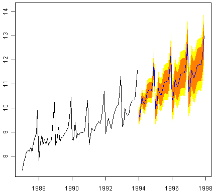
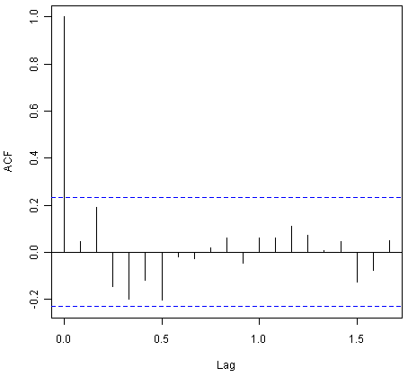
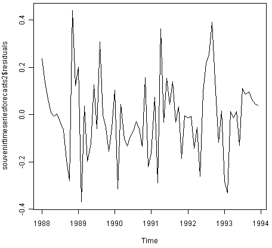
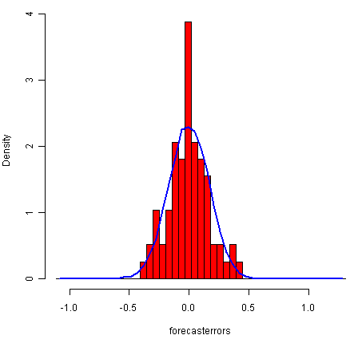
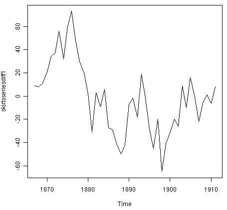
.. |image28| image:: ../_static/image28.png
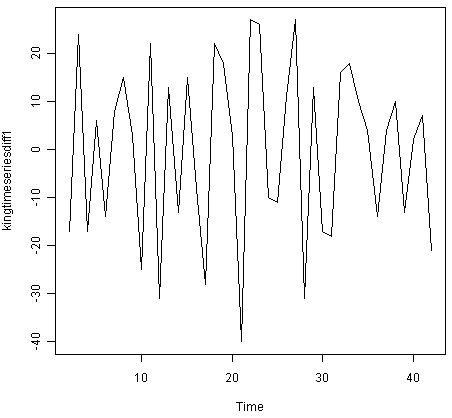
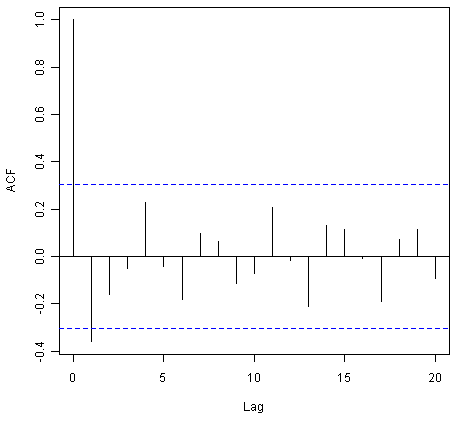
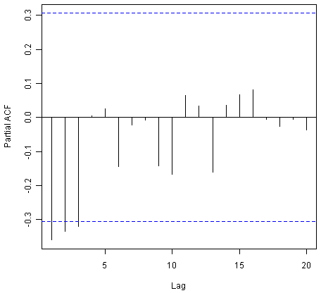
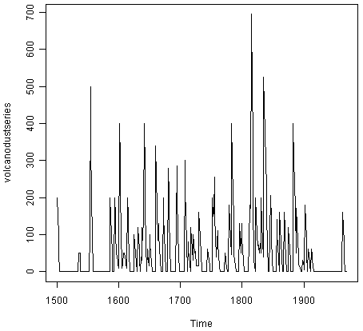
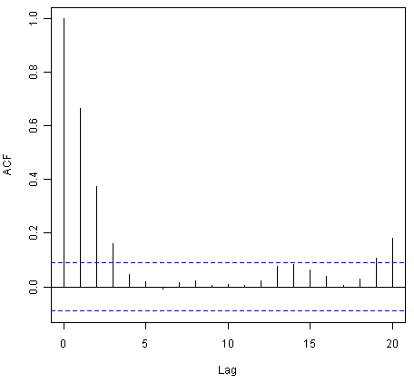
.. |image34| image:: ../_static/image34.png
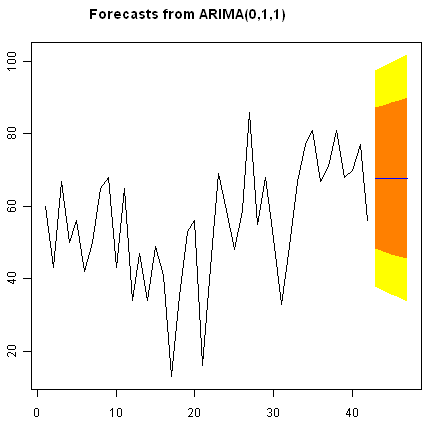
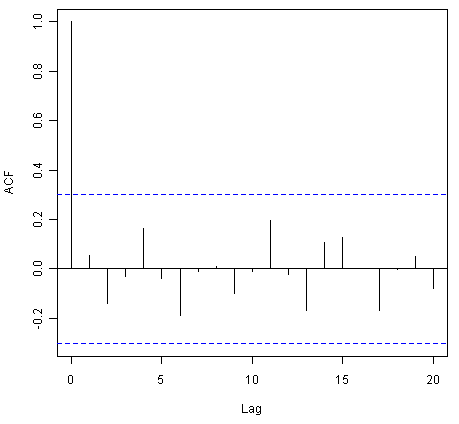
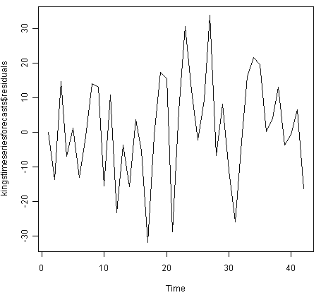
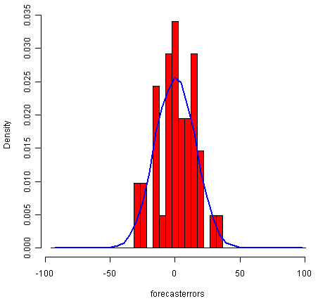
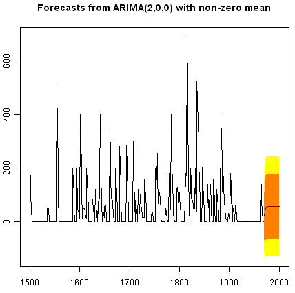
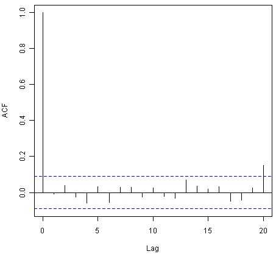
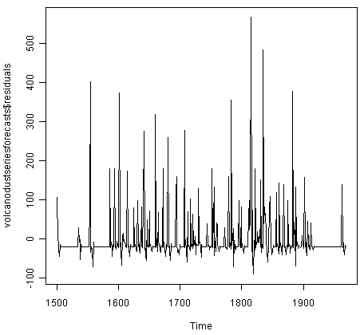
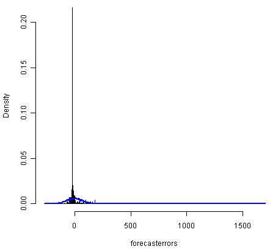

